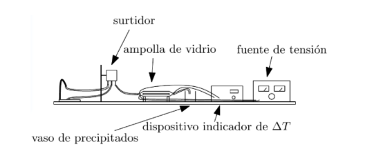

```{r setup, include=FALSE}
knitr::opts_chunk$set(echo = FALSE)
```

# Objetivos

- Determinación del calor específico del agua.
- Determinación del calor perdido.

# Introducción

Si hacemos pasar un flujo de agua por un tubo de vidrio, con sendos termómetros en los extremos y una resistencia calefactora, podemos medir el calor específico del agua. Consideremos la relación existente entre la potencia eléctrica y las magnitudes medidas. Asimismo, tengamos en cuenta la definición de potencia. Obtenemos la siguiente expresión:

\begin{equation}
    P = \frac{dE}{dt} = IV
\end{equation}

Donde toda la energía, \(E\), se transforma en calor. Este calor puede ser expresado como la suma del calor cedido al agua más el calor debido a las pérdidas laterales, \(Q_p\). Así pues, si tenemos en cuenta la expresión que relaciona el calor cedido al agua con el aumento de temperatura de esta y sustituimos en (1), obtenemos lo siguiente:

\begin{equation}
    IV = c \frac{dm}{dt} \Delta T + \frac{dQ_p}{dt}
\end{equation}

Donde \( dm/dt \) es el caudal, que denominaremos \( G \). La ecuación $(2)$ queda en:

\begin{equation}
    IV = c G \Delta T + \dot{Q}_p
\end{equation}

Donde la pérdida de potencia \( \dot{Q}_p \) es pequeña y puede considerarse constante. La ecuación $(3)$ es la ley a comprobar.
Tomando pares $(I\cdot V, \Delta T)$ y realizando un ajuste lineal de la potencia $IV$ sobre la diferencia de temperatura $\Delta T$, podremos obtener la pendiente $cG$ de la recta y su ordenada en el origen $\dot{Q}_p$. Para obtener, entonces, el calor específico del agua, hará falta hallar el caudal $G$ experimentalmente. Comprobaremos que, efectivamente, es constante en el tiempo.

\clearpage

# Dispositivo experimental y metodología

## Instrumentación
Los materiales necesarios para la realización de la práctica han sido:

- Una fuente de agua (grifo).  
- Un surtidor, colocado a cierta altura, con el objetivo de obtener una presión constante.  
- Un dispositivo consistente en una ampolla de vidrio con una resistencia calefactora en su interior.  
- Una fuente de tensión regulable que nos permita medir el voltaje y la intensidad suministrados en todo momento.  
- Sendas sondas térmicas conectadas a un medidor de temperatura serie PHYWE (precisión 0,1 ºC) que nos indica la diferencia de temperatura entre ambas.
- Un vaso de precipitados.  
- Diversos tubos de goma para hacer fluir el agua por ellos.  
- Una balanza de precisión serie SPX (precisión 0,1 g)

## Montaje experimental
El esquema del montaje se puede ver en la siguiente figura:

{width="400"}

Como se puede apreciar en el dibujo, las conexiones eléctricas de la resistencia van conectadas a la fuente de tensión. Así mismo, los dos cables correspondientes a las sondas térmicas van conectados al aparato que nos muestra la diferencia de temperaturas entre ellos. Por otra parte, el surtidor tiene tres salidas. En la misma entrada del surtidor, veremos que hay un tubo largo que sube hasta una altura significativa sobre este. Así será más fácil asegurar que toda el agua conectada a ella irá hacia el refrigerador. Las otras dos salidas irán conectadas: una de ellas hasta el grifo y la otra a uno de los extremos de la ampolla, debiendo haber colocado en el otro extremo de la ampolla un tubo que vaya a parar al vaso de precipitados durante las mediciones o bien al fregadero cuando no se estén tomando medidas. Los dispositivos utilizados aparecen en las siguientes figuras:

\clearpage

\begin{figure}
  \centering
  \begin{subfigure}{.22\textwidth}
    \centering
    \includegraphics[width=\linewidth]{figuras/calorimetro.jpg}
    \caption{Calorímetro}
  \end{subfigure}%
  \hfill
  \begin{subfigure}{.5\textwidth}
    \centering
    \includegraphics[width=\linewidth]{figuras/dispositivo_termico.jpg}
    \caption{Dispositivo térmico}
  \end{subfigure}%
  \hfill 
  \begin{subfigure}{.22\textwidth}
    \centering
    \includegraphics[width=\linewidth]{figuras/medidor_temperatura.jpg}
    \caption{Medidor de temperatura}
  \end{subfigure}%
  \caption{Dispositivos experimentales I}
  \label{fig:dispositivos1}
\end{figure}

\begin{figure}
  \centering
  \begin{subfigure}{.32\textwidth}
    \centering
    \includegraphics[width=\linewidth]{figuras/surtidor.jpg}
    \caption{Surtidor}
    \label{fig:sub1}
  \end{subfigure}%
  \hfill
  \begin{subfigure}{.32\textwidth}
    \centering
    \includegraphics[width=\linewidth]{figuras/balanza.jpg}
    \caption{Balanza}
    \label{fig:sub2}
  \end{subfigure}%
  \hfill 
  \begin{subfigure}{.32\textwidth}
    \centering
    \includegraphics[width=\linewidth]{figuras/vaso_precipitados.jpg}
    \caption{Vaso de precipitados}
    \label{fig:sub3}
  \end{subfigure}%
  \caption{Dispositivos experimentales II}
  \label{fig:dispositivos2}
\end{figure}

\clearpage
 
## Método de medida

- Se regula el flujo de agua de forma que el nivel de la misma no rebase el límite del surtidor, así mismo tampoco deberá quedarse sin agua el surtidor. Una vez regulado el flujo de agua no se volverá a tocar el grifo.

- Se coloca el vaso de precipitados a la salida de la ampolla de vidrio para recoger el agua que sale de la misma durante un cierto tiempo. Medimos la masa de agua con una balanza. Volvemos a realizar este proceso varias veces cada 5 minutos para constatar que el gasto de agua es constante. Hallar el gasto es tan sencillo como dividir la masa entre el tiempo.

- Por último, se conecta la fuente de tensión. Para comenzar, situamos el voltaje a 3 voltios. Dejamos que la resistencia se caliente durante aproximádamente 10 minutos y tomamos las medidas pertinentes de \( \Delta T\). Continuamos este procedimiento para diferentes voltajes, dejando un lapso de aproximadamente 8 minutos entre mediciones para que la resistencia se caliente. El voltaje se incrementa de 3V hasta 8V, debiendo tomar al menos 4 medidas de \( \Delta T\). 
 
# Medidas

Los datos recogidos para el cálculo del caudal vienen representados en la siguiente tabla:

```{r}
# Datos recogidos
i <- c(1,2,3,4,5,6,7)
m <- c(113.7,114.0,113.7,114.2,113.6,113.9,115.4) #gramos

# Tabla
data <- data.frame(i,m)
colnames(data) <- c("Medida","m / g")
  
knitr::kable(
  data,
  caption="Masa de agua que fluye tras 60 segundos",
  booktabs = TRUE,
  escape = FALSE,
  row.names = FALSE,
  align="c"
)

# Valor del cuadal y desviación típica
G <- mean(m)/60 #g/s
err_G <- sd(m)/60
```

Los datos recogidos para el cálculo del calor específico del agua y la perdida de potencia: 

```{r}
# Datos recogidos
i <- c(1,2,3,4)
V_1 <- c(2,4,6,7.8) #voltios
I_1 <- c(1,1.9,2.7,3.5) #amperios
P_1 <- I_1*V_1 #vatios
T1_1 <- c(15.7, 15.7, 15.7, 15.7) #celsius
T2_1 <- c(16.5, 17.8, 18.8, 19.5)
delta_T_1 <- T2_1-T1_1

# Tabla
data <- data.frame(i,V_1,I_1,P_1,T1_1,T2_1,delta_T_1)
colnames(data) <- c("Medida","V / V","I / A","P / W","$T_1$ / ºC","$T_2$ / ºC","$\\Delta T$ / ºC")
knitr::kable(
  data,
  caption="Medidas experimentales en el calorímetro y medidor de temperatura en la primera tanda",
  booktabs = TRUE,
  escape = FALSE,
  row.names = FALSE,
  align ="c"
)
```
```{r}
# Datos recogidos
i <- c(1,2,3,4)
V_2 <- c(2,4,6,7.8) #voltios
I_2 <- c(1,1.9,2.7,3.4) #amperios
P_2 <- I_2*V_2 #vatios
T1_2 <- c(15.8, 15.8, 15.8, 15.8) #celsius
T2_2 <- c(16.5, 17.8, 18.9, 19.7)
delta_T_2 <- T2_2-T1_2

# Tabla
data <- data.frame(i,V_2,I_2,P_2,T1_2,T2_2,delta_T_2)
colnames(data) <- c("Medida","V / V","I / A","P / W","$T_1$ / ºC","$T_2$ / ºC","$\\Delta T$ / ºC")
knitr::kable(
  data,
  caption="Medidas experimentales en el calorímetro y medidor de temperatura en la segunda tanda",
  booktabs = TRUE,
  escape = FALSE,
  row.names = FALSE,
  align="c"
)
```

\clearpage

# Análisis
Para obtener el caudal \( G = \frac{dm}{dt} \), calcularemos la media de los valores de las masas presentados en la tabla 1 y la dividiremos entre el tiempo total de medición del flujo (\(t = 60 \ s\)), dando un valor de \( G = `r G`\ g/s\). El error que estamos cometiendo tomando este valor del caudal vendrá determinado por la desviación típica:
\[
G = 1.90 \pm 0.01\ g/s
\]
A continuación, realizamos un ajuste lineal de \( I \cdot V \) frente a \( \Delta T\) para obtener los términos del modelo lineal presentado en el marco teórico en la ecuación $(3)$.
```{r, echo=FALSE,  out.width= "60%", fig.align='center', fig.cap="Ajuste lineal"}
# Ajuste lineal
modelo_lineal <- lm(P_1 ~ delta_T_1)
resumen <- summary(modelo_lineal)
pendiente_1 <- modelo_lineal$coefficients[[2]]
inc_pendiente_1 <- resumen$coefficients[2,2]
ordenada_1 <- modelo_lineal$coefficients[[1]]
inc_ordenada_1 <- resumen$coefficients[1,2]

# Graficamos los datos y la línea de ajuste
titulo <- "Ajuste lineal para la primera tanda"
plot(delta_T_1, P_1, main = titulo, ylab ="IV / W", xlab = expression(paste(Delta,"T / K")))
abline(modelo_lineal, col = "coral")
```
Los resultados del ajuste lineal para la primera tanda son:

- Pendiente: $`r pendiente_1`\ W/K$

- Incertidumbre pendiente: $`r inc_pendiente_1` \ W/K$

- Ordenada: $`r ordenada_1`\ W$

- Incertidumbre ordenada: $`r inc_ordenada_1` \ W$

\clearpage

```{r, echo=FALSE,  out.width= "60%", fig.align='center', fig.cap="Ajuste lineal"}
# Ajuste lineal
modelo_lineal <- lm(P_2 ~ delta_T_2)
resumen <- summary(modelo_lineal)
pendiente_2 <- modelo_lineal$coefficients[[2]]
inc_pendiente_2 <- resumen$coefficients[2,2]
ordenada_2 <- modelo_lineal$coefficients[[1]]
inc_ordenada_2 <- resumen$coefficients[1,2]

# Graficamos los datos y la línea de ajuste
titulo <- "Ajuste lineal para la segunda tanda"
plot(delta_T_2, P_2, main = titulo, ylab ="IV / W", xlab = expression(paste(Delta,"T / K")))
abline(modelo_lineal, col = "coral")
```

Los resultados del ajuste lineal para la segunda tanda son:

- Pendiente: $`r pendiente_2`\ W/K$

- Incertidumbre pendiente: $`r inc_pendiente_2` \ W/K$

- Ordenada: $`r ordenada_2`\ W$

- Incertidumbre ordenada: $`r inc_ordenada_2` \ W$


# Resultados

Identificando los términos del ajuste lineal con los del modelo lineal $(3)$, para cada tanda:
\[
c_1 \cdot G = 8.14 \pm 1.64\ W/K
\]
\[
\dot{Q}_{p_1} = -6.66 \pm 4.43\ W
\]
\[
c_2 \cdot G = 7.49 \pm 1.25\ W/K
\]
\[
\dot{Q}_{p_2} = -5.09 \pm 3.39\ W
\]
Llamemos \(p = c \cdot G \). Entonces podemos despejar el calor específico del agua \(c\) mediante la fórmula \( c = \frac{p}{G}\). Empleando la ley de propagación de errores \(\sigma^2 = \sum_i (\partial f / \partial x_i)^2 \sigma_i^2 \), podemos encontrar el error del calor específico del agua:
```{r}
# Calculo de c
c1 <- pendiente_1/G
c2 <- pendiente_2/G

# Calculo del error de c
err_c1 <- sqrt((inc_pendiente_1/G)^2 + (pendiente_1/G^2*err_G)^2)
err_c2 <- sqrt((inc_pendiente_2/G)^2 + (pendiente_2/G^2*err_G)^2)

# Media de las dos tandas
c <- (c1 + c2)/2
err_c <- (err_c1 + err_c2)/2
Qp <- (ordenada_1 + ordenada_2)/2
err_Qp <- (inc_ordenada_1 + inc_ordenada_2)/2
```
\begin{equation}
      \Delta c^2 =  \Big(\frac{1}{G} \cdot \Delta p \Big)^2 +  \Big(\frac{p}{G^2} \cdot \Delta G \Big)^2
\end{equation}
En definitiva:
\[
c_1  = 4.28 \pm 0.86\ \frac{J}{g \ K}
\]
\[
c_2  = 3.94 \pm 0.66\ \frac{J}{g \ K}
\]
Si nos quedamos con la media de ambos calores específicos y pérdidas de potencia:
\[
c  = 4.11 \pm 0.76\ \frac{J}{g \ K}
\]
\[
\dot{Q}_p = -5.88 \pm 3.91\ W
\]

\clearpage

# Discusión y conclusiones
En el laboratorio registramos, durante la realización del experimento, una temperatura de \(T_{Lab} = 16.7 \ ^\circ C \), presión \(P_{Lab} = 1017.9 \ HPa \) y humedad del $50\%$. Si consultamos la literatura, encontramos que el calor específico del agua a temperatura \( T_0 = 15 \ ^\circ C\) y presión \( P_0 = 1\ atm\) es de \(c_{Real} = 4.184 \ \frac{J}{g \ K}\). Podemos notar que este valor se encuentra dentro del intervalo de nuestro calor específico del agua experimental \( c_{Exp}  = 4.11 \pm 0.76\ \frac{J}{g \ K} \). Sin embargo, hemos de destacar las fuentes de error de este experimento.

Primeramente, debemos destacar que el aparato medidor de temperatura proporcionó un valor distinto de la temperatura en el primer extremo para cada tanda de medidas. Además, hay que tener en cuenta los errores de índole humana, como los presentes en la medición del caudal. Estos afectan tanto al tiempo de empleado para verter agua en el vaso de precipitado como las posibles pérdidas de agua durante su caída del tubo al vaso, por lo que el hecho de tomar la desviación estándar en las medidas de masa es quizá "optimista".

Finalmente, podríamos no estar en lo correcto al suponer que $\dot{Q}_p$ es constante (y/o pequeña), pues el haber obtenido una incertidumbre en su valor obtenido del mismo orden que su propio valor sugiere una menor fiabilidad en el resultado.
