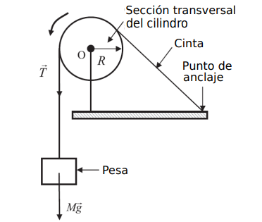

```{r setup, include=FALSE}
knitr::opts_chunk$set(echo = FALSE)
```

# Objetivos
- Comprobación de la equivalencia entre trabajo y calor, y medida de la relación entre caloría y Julio.

# Introducción
En esta práctica se dispone de una cinta enrollada en torno a un cilindro de aluminio de radio $R$, estando este montado sobre un eje rotatorio $O$, tal y como muestra la figura. La cinta queda sujeta a la mesa por un extremo y libre por el opuesto, donde cuelga una pesa de masa $M$. El soporte del cilindro cuenta con un termistor (resistencia eléctrica dependiente de la temperatura) conectado a un multímetro, así como con un contador que muestra el número de vueltas dadas por del cilindro.

{width="300"}

El trabajo $W$ realizado por la fuerza de rozamiento $F$ entre la cinta y el cilindro, para un desplazamiento $\Delta l$, viene dado por:

\begin{equation}
  W = F\Delta l
\end{equation}

El desplazamiento será $\Delta l = R\theta$, donde $\theta$ es el ángulo recorrido por el cilindro. Si consideramos el número de vueltas, se tendrá que $\theta = 2\pi N$. Así mismo, la fuerza de rozamiento será la debida al peso de la pesa. Es decir, $F = Mg$. Sustituyendo:

\begin{equation}
  W = 2\pi MgRN
\end{equation}

Tras rotar el cilindro por un determinado tiempo, el trabajo realizado generará una cantidad equivalente de calor:

\begin{equation}
  \frac{dQ}{dt} = \alpha \frac{dW}{dt}
\end{equation}

donde $\alpha = 1$ si tanto el calor como el trabajo se miden en Julios. Si el calor se mide en calorías y el trabajo en Julios, entonces $\alpha = \frac{1}{4.184}$ cal/J.

Nótese que hay que tener en cuenta también la potencia calorífica intercambiada con el laboratorio:

\begin{equation}
\frac{dQ}{dt} = \frac{dQ_{aparato}}{dt} + \frac{dQ_{laboratorio}}{dt}
\end{equation}

donde solo el primer término será medible directamente. El calor recibido por el dispositivo se mide como:

\begin{equation}
  Q_{aparato} = C\Delta T
\end{equation}

donde $\Delta T = T - T_0$ es el aumento de temperatura con respecto a la temperatura inicial del cilindro $T_0$, y $C = mc + C_{termistor} + C_{cinta}$, siendo $m$ la masa del cilindro y $c$ el calor específico del aluminio. Para este experimento tenemos que $mc \gg C_{termistor} + C_{cinta}$, por lo que:

\begin{equation}
  Q_{aparato} \approx mc\Delta T
\end{equation}

Tras un tiempo $\Delta t$ se tiene:

\begin{equation}
  mc\Delta T + \left(\frac{dQ_{laboratorio}}{dt}\right)\Delta t = \alpha 2\pi MgRN
\end{equation}

\clearpage

# Dispositivo experimental y metodología

## Instrumentación
- Dispositivo específico para la medición del equivalente mecánico.
- Dispositivo medidor de temperatura específico para este montaje (multímetro).
- Una pesa de masa conocida (4 kg).
- Un pie de rey.
- Una balanza.


## Montaje experimental

\begin{figure}[H]
  \begin{subfigure}{.45\textwidth}
    \centering
    \includegraphics[width=\linewidth]{figuras/manivela.jpg}
    \caption{Soporte para el cilindro con manivela y contador de vueltas.}
  \end{subfigure}%
  \hfill 
  \begin{subfigure}{.45\textwidth}
    \centering
    \includegraphics[height=6cm]{figuras/multimetro.jpg}
    \caption{Multímetro.}
  \end{subfigure}%
  \caption{Dispositivos usados en el montaje experimental}
\end{figure}

## Metodología

### Experiencia 1: Medida del cilindro en frío
1. Sacamos el cilindro del congelador procurando no manipularlo durante demasiado tiempo para no aumentar su temperatura.
2. Colocamos con delicadeza el cilindro en el eje de rotación, enroscando el tornillo para fijarlo. Enrollamos la cinta alrededor del cilindro, dando unas 5 o 6 vueltas.
3. Mientras se sujeta firmamente la manivela de rotación, se cuelga con cuidado la pesa en la arandela del extremo libre de la cinta.
4. Ajustamos el contador de vueltas a cero.
5. Encendemos el multímetro para medir la resistencia. Comprobamos la temperatura inicial mediante la tabla de calibración del termisor. Registramos la temperatura ambiente del laboratorio.
6. Iniciamos el cronómetro y empezamos a rotar el cilindro a ritmo constante, evitando que la pesa ascienda. Se mide periodicamente el tiempo transcurrido, el número de vueltas y la resistencia del termisor.
7. Se rota el cilindro a ritmo constante durante el tiempo suficiente como para que la temperatura final supere a la temperatura ambiente, en una magnitud igual a la diferencia entre la temperatura ambiente y la temperatura inicial del cilindro.
8. Medimos la masa del cilindro $m$ con la balanza y el diámetro $D$ con el pie de rey.

### Experiencia 2: Medida del cilindro a temperatura ambiente
1. Dejamos que el cilindro alcance la temperatura ambiente.
2. Repetir la experiencia anterior desde el paso 4.
3. Al finalizar el proceso de calentamiento, inicia de nuevo el cronómetro y deja enfriar el cilindro, sin extrarlo del dispositivo, por un tiempo similar al tiempo de calentamiento. Anota periódicamente el tiempo de enfriamiento transcurrido y la resistencia del termistor.

## Metodología para el análisis de datos

### Experiencia 1: Medida del cilindro en frío
La representación del calor recibido por el cilindro $mc\Delta T$ frente al trabajo $2\pi MgRN$ realizado para el número de vueltas $N$ debe proporcionar una recta cuya pendiente permite hallar $\alpha$. En este caso, puede omitirse el intercambio de calor entre el cilindro y el laboratorio, ya que el calor absorbido por el cilindro cuando este esté más frío que el ambiente será equivalente al desprendido cuando el cilindro esté más caliente que el ambiente.

### Experiencia 2: Medida del cilindro a temperatura ambiente
Para estimar el segundo término a la izquierda de la ecuación $(7)$, ahora no despreciable, pondremos:

\begin{equation}
  \frac{dQ_{laboratorio}}{dt} \approx -mc \frac{dT_e}{dt}
\end{equation}

donde $T_e$ es la temperatura relativa al enfriamiento. Aunque $\frac{dT_e}{dt}$ no es constante, puede aproximarse como tal sustituyéndola con el valor de la pendiente de la regresión linear de la curva de enfriamento durante periodos de calentamiento no demasiado largos o, lo que es lo mismo, para diferencias de temperatura no demasiado altas. Corregir cada dato multiplicando la ecuación $(8)$ por el relativo $\Delta t$ y volver a calcular $\alpha$.

\clearpage

# Medidas y análisis de los datos

En cuanto a las dimensiones del cilindro, se midió un diámetro $D=49.7\ mm$ y una masa $m=201.1\ g$. Por otro lado la masa de la pesa se supone conocida con valor $M=4\ kg$, y la capacidad calorífica del aluminio también, con valor $c=897\frac{J}{kg\ K}$.

## Experiencia 1

Tras colocar el cilindro en el soporte y medir su resistencia inicial obtenemos $T_0\approx 3^\circ C$ (primera entrada de la tabla). Los datos de resistencia medidos tras cada intervalo de tiempo y cada número de vueltas se recogen en la siguiente tabla. También aparecen los datos de temperatura, que se han obtenido a partir de la tabla de equivalencias del termistor aplicando interpolación lineal.

```{r}
# Datos recogidos
i <- 1:31
vueltas1 <- seq(0,1200,40)

# Tiempo (s)
m1 <- c(0,1,2,3,4,5,6,7,8,9,11,11,12,13,14,15,16,17,18,19,20,21,22,22,23,24,25,26,26,27,28) # Minutos
n1 <- c(0,0,2,7,15,30,42,48,50,51,0,56,52,45,46,46,43,40,31,28,18,12,01,52,41,30,20,10,58,45,33)# Segundos
t1 <- m1*60+n1

# Resistencia en kΩ
R1 <- c(300,292.1,350,230.1,183.4, 182,157,152.5,142.8,145.7,125.5, 118.4, 113.5,115.4,105.6,104.7,103,113.4,108.6,104.2,99.7,95.3,91.3,87.6,84.2,81,78.1,75.4,72.8,70.5,68.4)

# Vectores de temperatura (°C) y resistencia (kΩ) de la tabla del termistor
temperatura <- 0:40
resistencia <- c(351.02,332.64,315.32,298.99,283.6,269.08,255.38,242.46,230.26,218.73,207.85,197.56,187.84,178.65,169.95,161.73,153.95,146.58,139.61,133,126.74,120.81,115.19,109.85,104.8,100,95.447,91.126,87.022,83.124,79.422,75.903,72.56,69.38,66.356,63.48,60.743,58.138,55.658,53.297,51.048)  # kΩ

# Función para obtener la temperatura a partir de la resistencia por interpolación
obtener_temperatura <- function(R) {
  approx(resistencia, temperatura, xout = R, method = "linear")$y
}

# Temperaturas asociadas (ºC)
T1 <- round(obtener_temperatura(R1),2)

# Tabla
data <- data.frame(i,vueltas1,t1,R1,T1)
colnames(data) <- c("Medida", "Vueltas", "t / s", "R / $k\\Omega$", "T / $^\\circ C$")
  
knitr::kable(
  data,
  caption="Datos registrados de la resistencia del cilindro a tiempo y número de vueltas determinadas. Experiencia 1.",
  booktabs = TRUE,
  escape = FALSE,
  row.names = FALSE,
  align="c"
)
```

\clearpage

A partir de las medidas experimentales hacemos un ajuste de acuerdo a la ecuación (3), calculando el trabajo y el calor de acuerdo a las ecuaciones (2) y (6).

```{r, echo=FALSE,  out.width= "70%", fig.align='center', fig.cap="Ajuste por mínimos cuadrados para la experiencia 1"}
# Datos recogidos
diamCilind <- 47.9*1e-3 # m
mCilind <- 0.2011 # masa del cilindro Kg
RCilind <- diamCilind/2 # radio del cilindro m
MPesa <- 4 #Kg
CAlum <- 897 # calor especifico del aluminio J/ kg K
g <- 9.81 
T0 <- 3 # Celsius
DeltaT1 <- T1-T0 # Variacion de temperatura

# Calculo de energías involucradas
Q <- mCilind * CAlum * DeltaT1 # Calor mcT
W <- 2*pi * MPesa * g * RCilind * vueltas1

#Q <- Q[18:25]
#W <- W[18:25]

# Ajuste lineal
modelo_lineal1 <- lm(Q ~ W)
resumen1 <- summary(modelo_lineal1)
pendiente1 <- modelo_lineal1$coefficients[[2]]
inc_pendiente1 <- resumen1$coefficients[2,2]
ordenada1 <- modelo_lineal1$coefficients[[1]]
inc_ordenada1 <- resumen1$coefficients[1,2]

# Graficamos los datos y la línea de ajuste

titulo <- "Ajuste lineal de Q sobre W"
plot(W,Q,
     main = titulo,
     ylab =expression(Q ~ (J)),
     xlab =expression(W ~ (J)))
abline(modelo_lineal1, col = "coral")
```

obtiendo los siguientes resultados:

- Pendiente: $\alpha = `r pendiente1`$

- Incertidumbre pendiente: $\Delta \alpha =`r inc_pendiente1`$

Expresándolo correctamente:
\[
\alpha = `r round(pendiente1,3)` \pm `r signif(inc_pendiente1,2)`
\]


\clearpage

## Experiencia 2

En primer lugar medimos la variación de resistencia respecto al tiempo mientras dejamos que el cilindro se enfríe, esto nos permitirá estimar la cantidad de calor cedida al ambiente. De nuevo los datos de temperatura se han obtenido interpolando los datos tabulados de temperaturas correspondientes a cada valor de resistencia.

```{r}
# Datos recogidos
i <- 1:15

m2 <- 1:15 #minutos
t2 <- m2*60 #Tiempo (s)


# Resistencia en kΩ y temperaturas asociadas
R2 <- c(70.2,72,73.6,75.3,76.9,78.4,79.8,81.2,82.6,83.9,85.1,86.3,87.4,88.6,89.7)
T2 <- round(obtener_temperatura(R2),2)

# Tabla
data <- data.frame(i,t2,R2,T2)
colnames(data) <- c("Medida", "t / s", "R / $\\Omega$", "T / $^\\circ$C")
  
knitr::kable(
  data,
  caption="Resistencia del cilindro durante el enfriamiento",
  booktabs = TRUE,
  escape = FALSE,
  row.names = FALSE,
  align="c"
)
```

Obtenemos la pendiente $\frac{dT_e}{dt}$ que, si bien no es constante, puede aproximarse como tal sustituyéndola por el valor de la pendiente de la regresión linear de la curva de enfriamento durante periodos de calentamiento no demasiado largos o, lo que es lo mismo, para diferencias de temperatura no demasiado altas (a altas temperaturas la dependencia deja de ser lineal y pasa a ser exponencial). A partir de las medidas experimentales hacemos un ajuste entre ambas cantidades, obteniendo los siguientes resultados:

```{r, echo=FALSE,  out.width= "70%", fig.align='center', fig.cap="Ajuste para estimar la pendiente $\\frac{dT_e}{dt}$"}
# Ajuste lineal
modelo_lineal2 <- lm(T2 ~ t2)
resumen2 <- summary(modelo_lineal2)
pendiente2 <- modelo_lineal2$coefficients[[2]]
inc_pendiente2 <- resumen2$coefficients[2,2]
ordenada2 <- modelo_lineal2$coefficients[[1]]
inc_ordenada2 <- resumen2$coefficients[1,2]

# Graficamos los datos y la línea de ajuste

titulo <- expression("Ajuste lineal de"~T[e]~"sobre t")
plot(t2, T2,
     main = titulo,
     ylab = expression(T[e] ~ (degree * C)),
     xlab = expression(t ~ (s)))
abline(modelo_lineal2, col = "coral")
```

- Pendiente: $\frac{dT_e}{dt} = `r pendiente2` \ K/s$

- Incertidumbre pendiente: $\Delta \frac{dT_e}{dt} =`r inc_pendiente2` \ K/s$

En cuanto a las medidas registradas al volver a accionar la manivela para calentar el cilindro, obtenemos la siguiente tabla.

```{r}
# Datos recogidos
i <- 1:14
vueltas3 <- seq(0,520,40) #Vueltas

# Tiempo recogido
m3 <- c(0,0,1,2,2,3,4,5,5,6,7,7,8,9) #minutos
n3 <- c(0,42,28,14,58,42,24,07,49,30,10,53,35,18)
t3 <- m3*60+n3 #Tiempo total (s)

# Resistencia en kΩ y temperaturas asociadas
R3 <- c(89.5,85.8,82.3,78.8,75.7,72.9,70.2,67.7,65.4,63.3,61.1,59.5,57.7,56.2)
T3 <- round(obtener_temperatura(R3),2)

# Tabla
data <- data.frame(i,vueltas3,t3,R3,T3)
colnames(data) <- c("Medida", "Vueltas", "t / s", "R / $\\Omega$", "T / $^\\circ$C")
  
knitr::kable(
  data,
  caption="Datos registrados de la resistencia del cilindro a tiempo y vueltas dadas. Experiencia 2.",
  booktabs = TRUE,
  escape = FALSE,
  row.names = FALSE,
  align="c"
)
```
A partir de las medidas experimentales hacemos un ajuste de acuerdo a la ecuación $(7)$, teniendo en cuenta ahora que $\frac{dQ_{laboratorio}}{dt}$ viene dado por la ecuación $(8)$, obtenemos los siguientes resultados:


```{r, echo=FALSE,  out.width= "65%", fig.align='center', fig.cap="Ajuste por mínimos cuadrados para la experiencia 2"}
# Datos recogidos
T0 <- 27 # Celsius
DeltaT3 <- T3-T0 # Variacion de temperatura
dt3 <- t3[14] # tiempo tardado en dar esas vueltas

# Calculo de energías involucradas 
# Calor mcT con factor corregidos
Q3 <- mCilind * CAlum * (DeltaT3 - dt3 * pendiente2)
# Trabajo
W3 <- 2*pi * MPesa * g * RCilind * vueltas3

# Ajuste lineal
modelo_lineal3 <- lm(Q3 ~ W3)
resumen3 <- summary(modelo_lineal3)
pendiente3 <- modelo_lineal3$coefficients[[2]]
inc_pendiente3 <- resumen3$coefficients[2,2]
ordenada3 <- modelo_lineal3$coefficients[[1]]
inc_ordenada3 <- resumen3$coefficients[1,2]

# Graficamos los datos y la línea de ajuste

titulo <- "Ajuste lineal de Q sobre W"
plot(W3,Q3, main = titulo, ylab =expression(Q ~ (J)), xlab =expression(W ~ (J)))
abline(modelo_lineal3, col = "coral")
```

- Pendiente: $\alpha = `r pendiente3`$

- Incertidumbre pendiente: $\Delta \alpha =`r inc_pendiente3`$

Expresándolo correctamente:
\[
\alpha = `r round(pendiente3,3)` \pm `r signif(inc_pendiente3,2)`
\]


\clearpage

# Discusión y conclusiones de los resultados

En primer lugar, si bien hemos obtenido valores similares del parámetro $\alpha$ en ambas experiencia, estos se encuentra lejos del valor esperado $\alpha_{teor} = 1$. Aunque las incertidumbres correspondientes a cada resultado sean lo suficientemente pequeñas como para no recoger este valor esperado, existen diversas fuentes de error presentes en cada experiencia que afectan a la fiabilidad de los resultados y no se ven reflejadas en esta incertidumbre.

En cuanto a la experiencia 1, las primeras medidas que se realizaron en la primera experiencia no fueron del todo coherentes. Podemos observar que algunos valores de la resistencia que proporcionaba el multímetro (Tabla 1) no parecen tener sentido, por ejemplo, el tercer valor corresponde a una temperatura que debería ser más baja que la inicial, mientras que en la medida 14 tenemos una temperatura más baja que en la medida 13. También se produjo una anomalía en la medida $18$, donde la temperatura del cilindro disminuyó repentinamente (según el multímetro). Lo razonable hubiera sido que según avanzaba el tiempo la resistencia fuera disminuyendo, y por tanto la temperatura del cilindro fuera aumentando, pero vemos que algunos valores medidos no reflejan este hecho. Otro hecho a destacar es que el ritmo de giro no fue constante, ya que empezamos a girar la manivela demasiado lentamente, con lo cual tuvimos que aumentar el ritmo de giro y solo fue aproximadamente constante durante las últimas medidas. Sin embargo, el hecho de que el ritmo de giro no fue estrictamente constante, sobre todo al comienzo de la experiencia, no explica las oscilaciones de temperatura tan amplias.

Respecto a la experiencia 2, hay que tener en cuenta principalmente el error que pueda provenir de la estimación de $\frac{dT_e}{dt}$. En esta segunda experiencia si que se fue más cuidadoso y se intentó manter una velocidad de giro aproximadamente constante. También es importante comentar que se tomaron considerablemente menos medidas para esta experiencia que para la experiencia 1.

En relación con ambas experiencias, debemos destacar que disponíamos solamente de unos pares concretos de temperaturas con sus correspondientes resistencias en el resistor. En concreto, la tabla ofrecía una correspondencia entre temperaturas enteras ($T \in \mathbb{Z}^+$) y resistencia, por lo que a partir de las resistencias medidas por el multímetro, hemos obtenido las temperaturas por interpolación de estos pares de datos tabulados.

En la propia base teórica para obtener los resultados también existen diversas fuentes de error que han de ser consideradas. La más inmediata es la aproximación de la ecuación $(7)$ que realizamos para la segunda experiencia, donde estimamos las pérdidas de calor suponiendo que la pendiente $\frac{dT_e}{dt}$ es constante (cuando, para altas temperaturas, esta aproximación deja de ser tan precisa). 

De todas formas, y aunque el valor $\alpha=1$ no esté comprendido en nuestros resultados experimentales, las experiencias comprueban cualitativamente el funcionamiento de nuestro marco teórico.


