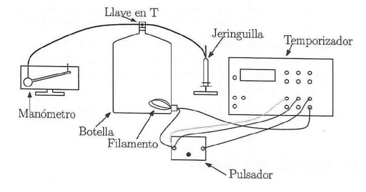

```{r setup, include=FALSE}
knitr::opts_chunk$set(echo = FALSE)
```

# Objetivos

- Determinación del calor específico del aire a presión constante y a volumen constante.
- Comprobación de la relación de Mayer y del valor del coeficiente de dilatación adiabática para un gas ideal.

# Marco teórico

La capacidad calorífica \( C \) de una sustancia viene expresada por:
\begin{equation} 
  C = \frac{dQ}{dT}
\end{equation}
Normalmente un proceso no viene definido completamente por la variación de temperatura, sino que se exige el conocimiento de otros parámetros macroscópicos. La capacidad calorífica tiene un valor definido sólo para un proceso definido. Los dos procesos principales son los de presión constante y volumen constante.

La capacidad calorífica a volumen constante se expresa del modo:
\begin{equation} 
  C_V = \left( \frac{dQ}{dT} \right)_V
\end{equation} 
Del mismo modo, la capacidad calorífica a presión constante es:
\begin{equation} 
  C_P = \left( \frac{dQ}{dT} \right)_P 
\end{equation} 
Si tomamos como unidad de cantidad de sustancia el mol, dividiendo por el número de moles \( n \) obtenemos los calores molares:
\begin{equation} 
  \overline{C} = \frac{1}{n} \frac{dQ}{dT}
\end{equation} 
Según la teoría, el calor molar a volumen constante de un gas ideal viene dado por:
\begin{equation} 
  \overline{C}_V = \frac{f}{2} R 
\end{equation} 
donde \( f \) es el número de grados de libertad del gas ideal estudiado. Para el gas ideal monoatómico \( f = 3 \) y para el diatómico \( f = 5 \).

De acuerdo con la Primera Ley de la Termodinámica y la ecuación de estado para gases ideales, la relación de Mayer establece que:
\begin{equation} 
  \overline{C}_{P} - \overline{C}_{V} = R
\end{equation} 
donde \( R \) es la constante universal de los gases ideales, \( R = 8,31 \, \text{J/(K mol)} \).

Por otro lado, el coeficiente de dilatación adiabática del gas ideal viene dado por:
\begin{equation} 
  \gamma = \frac{C_{P}}{C_{V}} = \frac{f + 2}{f}
\end{equation} 

## Calor específico molar a volumen constante

Para la medida de \( C_V \) se calienta el aire encerrado en una botella de volumen \( V \) mediante el calor producido por una corriente eléctrica \( I \) y un potencial constante \( V_e \) durante un tiempo \( t \). Por lo tanto el calor aplicado al aire será:
\begin{equation} 
  Q = V_e I t
\end{equation} 
Para una transformación isócola el aumento de temperatura \( \Delta T \) y el aumento de presión \( \Delta P \) están relacionados mediante:
\begin{equation} 
 \Delta T = \frac{V}{nR} \Delta P
\end{equation}  
Por tanto:
\begin{equation} 
  \overline{C}_{V} = \frac{1}{n} \left( \frac{Q}{\Delta T} \right)_V = \frac{V_e I R}{V \Delta P}
\end{equation} 
La medida de \( \Delta P \) frente al tiempo \( t \) que se aplica la corriente:
\begin{equation} 
  \Delta P = \frac{V_e I R}{V \overline{C}_{V}} t = a t
\end{equation} 
permite obtener \( C_V \) de la pendiente \( a = V_e I R / V \overline{C}_{V} \) obtenida por mínimos cuadrados.

## Calor específico molar a presión constante

Para la medida de \( C_P \) se calienta el aire, permitiendo el aumento de volumen del gas empujando el émbolo de la jeringuilla, de tal manera que se mantenga la presión igual a la atmosférica en todo momento, \( P = P_{\text{atm}} \). Para una transformación isobárica, el aumento de temperatura \( \Delta T \) y el aumento de volumen \( \Delta V \) vienen relacionados por:
\begin{equation} 
  \Delta T = \frac{P}{nR} \Delta V
\end{equation} 
Por tanto, el calor específico molar a presión constante quedará expresado como:
\begin{equation} 
  \overline{C}_{P} = \frac{1}{n} \left( \frac{Q}{\Delta T} \right)_P = \frac{V_e I R}{P \Delta V}
\end{equation} 
La medida de \( \Delta V \) frente al tiempo \( t \) que se aplica la corriente:
\begin{equation} 
  \Delta V = \frac{V_e I R}{P \overline{C}_{P}} t = a t
\end{equation} 
permite obtener \( C_P \) de la pendiente \( a = V_e I R / P \overline{C}_{P} \) obtenida por mínimos cuadrados.

\clearpage

# Dispositivo experimental y metodología

## Montaje experimental

Para ambos experimentos utilizaremos el mismo dispositivo. Tenemos una botella (con su volumen previamente medido, \( V = 5 \, \text{l} \)). En el tapón de la misma viene acoplada una llave de paso para poder mantener el sistema a volumen o presión constante. En la llave están conectadas dos gomas: una conectada a una jeringuilla (con la que mediremos la variación de volumen) y la otra goma conectada a un manómetro para medir la presión.

{width="250"}

La resistencia calefactora va conectada a un circuito de corriente alterna, con potencial e intensidad constante, conectada a su vez a un temporizador, por lo que podremos medir la cantidad de calor y un pulsador para controlar la cantidad de tiempo que aplicamos ese calor.

\begin{figure}[H]
  \begin{subfigure}{.31\textwidth}
    \centering
    \includegraphics[width=\linewidth]{figuras/manometro.jpg}
    \caption{Manómetro.}
  \end{subfigure}%
  \hfill 
  \begin{subfigure}{.31\textwidth}
    \centering
    \includegraphics[width=\linewidth]{figuras/botella.jpg}
    \caption{Botella aislada con corcho.}
  \end{subfigure}%
  \hfill 
  \begin{subfigure}{.31\textwidth}
    \centering
    \includegraphics[width=\linewidth]{figuras/temporizador.jpg}
    \caption{Temporizador.}
  \end{subfigure}%
  \caption{Dispositivos experimentales 1}
\end{figure}

\begin{figure}[H]
  \begin{subfigure}{.31\textwidth}
    \centering
    \includegraphics[width=\linewidth]{figuras/jeringuilla.jpg}
    \caption{Jeringuilla.}
  \end{subfigure}%
  \hfill 
  \begin{subfigure}{.31\textwidth}
    \centering
    \includegraphics[width=\linewidth]{figuras/multimetro.jpg}
    \caption{Multímetros.}
  \end{subfigure}%
  \hfill 
  \begin{subfigure}{.31\textwidth}
    \centering
    \includegraphics[width=\linewidth]{figuras/pulsador.jpg}
    \caption{Pulsador.}
  \end{subfigure}%
  \caption{Dispositivos experimentales 2}
\end{figure}

## Metodología

### Experiencia 1: Medida del calor específico molar a volumen constante

1. Durante esta experiencia no se varía el volumen de aire en la jeringuilla, que se mantiene en 0 ml. Se usa la llave en forma de “T” para aislar la jeringuilla de la botella. Se suelta la goma que va al manómetro y se espera unos minutos hasta que la presión y temperatura del aire de la botella se equilibren con las atmosféricas. Medimos y anotamos la presión inicial marcada por el manómetro.

2. Ajustamos la goma a la salida del manómetro que está sobre el depósito de líquido. Si el aire de la botella está equilibrado, la lectura del manómetro no debería cambiar de forma apreciable.

3. Cerramos el circuito eléctrico con el pulsador, apretando durante un tiempo determinado. El tiempo que mantenemos el dedo pulsado queda grabado en el temporizador, registramos ese tiempo. La barra de líquido rojo va ascendiendo por el manómetro mientras aplicamos calor, anotamos la presión máxima medida para poder obtener la variación de presión.

4. Repetimos el proceso para tiempos mayores obteniendo distintas medidas de \( \Delta P \) vs \( t \). Antes de cada nueva medida, desconectamos la goma del manómetro durante aproximadamente un minuto, permitiendo que el aire de la botella vuelva a las condiciones ambientales.

### Experiencia 2: Medida del calor específico molar a presión constante

1. Durante esta experiencia sí se varía el volumen de aire en la jeringuilla. Usamos la llave en forma de “T” para conectar de nuevo la jeringuilla de la botella. Soltamos la goma que va al manómetro y esperamos unos minutos hasta que la presión y temperatura del aire de la botella se equilibren con las atmosféricas. Medimos y anotamos la presión inicial marcada por el manómetro.

2. Ajustamos la goma a la salida del manómetro que está sobre el depósito de líquido. Si el aire de la botella está equilibrado, la lectura del manómetro no debería cambiar de forma apreciable.

3. Aumentamos el volumen de la jeringuilla, de manera que la presión del manómetro cae. Al accionar el circuito el gas se calentará, la estrategia será aplicar corriente durante el tiempo suficiente como para que la presión máxima del manómetro vuelva al valor anotado en el punto 1. Para cada volumen, realizamos varias medidas de tiempo (al menos 3) que resulten en presiones máximas próximas a la inicial.

4. Repetimos el proceso para volúmenes mayores obteniendo así distintas medidas de \( \Delta V \) vs \( t \). Antes de cada nueva medida desconectamos la goma del manómetro, volvemos a poner el volumen de la jeringuilla a 0 ml y permitimos que el aire de la botella vuelva a las condiciones ambientales, durante aproximadamente un minuto.

## Metodología para el análisis de los datos

### Experiencia 1: Medida del calor específico molar a volumen constante

1. Representamos \( \Delta P \) frente a \( t \) y realizamos un ajuste por mínimos cuadrados, obteniendo el valor e incertidumbre de la pendiente.

2. Hallamos el valor del calor específico molar a volumen constante y su incertidumbre a partir de la pendiente obtenida.

### Experiencia 2: Medida del calor específico molar a presión constante

1. Representamos \( \Delta V \) frente a \( t \) y realizamos un ajuste por mínimos cuadrados, obteniendo el valor e incertidumbre de la pendiente.

2. Hallamos el valor del calor específico molar a presión constante y su incertidumbre a partir de la pendiente obtenida.

\clearpage

# Medidas y análisis de los datos

En ambos experimentos se le suministra al circuito un voltaje $V_e=4.81\ V$ y una intensidad de corriente $I=0.26\ A$. La temperatura ambiental registrada en el laboratorio es $T_{lab}=18.9^\circ C$, y el volumen de la botella es de $10\ l$. Para el cálculo de $\overline{C}_V,\overline{C}_P$ se emplea el valor $R=8.314472 \frac{Pa\ m^3}{\text{mol}\ K}$.

## Experiencia 1

Las medidas de la experiencia 1 se realizan con el sistema a volumen constante igual a $10\ l$. Siguiendo el procedimiento experimental explicado antes se obtuvieron las siguientes medidas.

```{r}
volumen <- 10*1e-3 #m^3
voltaje <- 4.81 # Volttttios
intensidad <- 0.26 # Amperios
Tlab <- 18.9 + 273.15 # Kelvin
Plab <- 1012.6*1e2 # Pascales
R <- 8.314472 #Pa m^3/mol K
  
# Datos recogidos
t <- c(0.468, 0.863, 1.214, 1.617, 2.071, 2.639, 3.345, 4.069, 4.537, 5.253)
P <- c(0.1,0.2,0.3,0.4,0.5,0.6,0.7,0.8,0.9,1) 

# Tabla
data <- data.frame(t,P)
colnames(data) <- c("t / s","$\\Delta P$ / mbar")
  
knitr::kable(
  data,
  caption="Tiempo durante el cual el circuito queda cerrado y variación de presión registrada",
  booktabs = TRUE,
  escape = FALSE,
  row.names = FALSE,
  align="c"
)
```

A partir de las medidas experimentales hacemos un ajuste de acuerdo a la ecuación (11), obtiendo los siguientes resultados (Figura 4):

```{r, echo=FALSE,  out.width= "90%", fig.align='center', fig.cap="Ajuste por mínimos cuadrados correspondiente a la experiencia 1."}

t <- t[1:5]
P <- P[1:5]

# Ajuste lineal
modelo_lineal <- lm(P ~ t)
resumen <- summary(modelo_lineal)
pendiente <- modelo_lineal$coefficients[[2]]
inc_pendiente <- resumen$coefficients[2,2]
ordenada <- modelo_lineal$coefficients[[1]]
inc_ordenada <- resumen$coefficients[1,2]

# Graficamos los datos y la línea de ajuste
titulo <- expression("Ajuste lineal de"~Delta*P~"sobre t")
plot(t,P,
     main = titulo,
     ylab =expression(Delta * P ~ (mbar)),
     xlab =expression(t ~ (s)))
abline(modelo_lineal, col = "coral")

# Cálculo de Cv
Cv <- voltaje*intensidad*R/(volumen*pendiente*100) # 1 mbar = 100 Pa
inc_Cv <- voltaje*intensidad*R/volumen * inc_pendiente/pendiente^2 * 1/100
```

- Pendiente: $a = \frac{V_e I R}{ V \overline{C}_{V}} =`r pendiente` \ \frac{mbar}{s}$

- Incertidumbre pendiente: $\Delta a =`r inc_pendiente` \ \frac{mbar}{s}$

Expresándolo correctamente:
\[
a = `r round(pendiente,4)`0 \pm `r signif(inc_pendiente,2)` \ \frac{mbar}{s}
\]

Despejando de $\overline{C}_{V}$ a partir de la pendiente como $\overline{C}_{V} = \frac{V_e I R}{ V a}$, obtenemos un valor de $\overline{C}_{V} =`r Cv` \ \frac{J}{mol \ K}$. Si además usamos la fórmula de propagación de errores \(\sigma^2 = \sum_i (\partial f / \partial x_i)^2 \sigma_i^2\), la expresión que tenemos que usar para calcular el error es:

\begin{equation*}
\Delta \overline{C}_{V} = \frac{V_e I R}{ V } \cdot \frac{\Delta a}{a^2}
\end{equation*}

de donde obtenemos que $\Delta \overline{C}_{V} =`r inc_Cv` \ \frac{J}{mol \ K}$. Expresándolo correctamente:

\[
\overline{C}_{V} = `r round(Cv,1)` \pm `r signif(inc_Cv,2)` \ \frac{J}{mol \ K}
\]

\clearpage

## Experiencia 2

En este experimento mantenemos la presión aproximadamente constante e igual a la presión del laboratorio, cuyo valor registrado fue $P_{lab} = 1012.6$ HPa. Para cada volumen se realizaron tres mediciones temporales $t_1,t_2,t_3$, tomando como tiempo final $t$ el promedio de los tres tiempos registrados, los datos se recogen en la siguiente tabla.

```{r}
# Datos recogidos
V2 <- 1:5 #mL
t2_1 <- c(0.411, 0.727, 1.081, 1.487, 1.874)
t2_2 <- c(0.417, 0.840, 1.047, 1.571, 2.040)
t2_3 <- c(0.446, 0.800, 1.052, 1.340, 1.905)
t2 <- round((t2_1+t2_2+t2_3)/3,3)

# Tabla
data <- data.frame(V2,t2_1,t2_2,t2_3,t2)
colnames(data) <- c("$\\Delta V$ / ml","$t_1$ / s","$t_2$ / s","$t_3$ / s","$t$ / s")
  
knitr::kable(
  data,
  caption="Tiempos para compensar cada variación de volumen y tiempo promediado",
  booktabs = TRUE,
  escape = FALSE,
  row.names = FALSE,
  align="c"
)
```

A partir de estas medidas experimentales hacemos un ajuste de acuerdo a la ecuación (14) obtiendo los siguientes resultados:

```{r, echo=FALSE,  out.width= "90%", fig.align='center', fig.cap="Ajuste por mínimos cuadrados correspondiente a la experiencia 2."}
# Ajuste lineal
modelo_lineal2 <- lm(V2 ~ t2)
resumen2 <- summary(modelo_lineal2)
pendiente2 <- modelo_lineal2$coefficients[[2]]
inc_pendiente2 <- resumen2$coefficients[2,2]
ordenada2 <- modelo_lineal2$coefficients[[1]]
inc_ordenada2 <- resumen2$coefficients[1,2]

# Graficamos los datos y la línea de ajuste
titulo <- expression("Ajuste lineal de"~Delta*V~"sobre t")
plot(t2,V2,
     main = titulo,
     ylab =expression(Delta*V ~ (ml)),
     xlab =expression(t ~ (s)))
abline(modelo_lineal2, col = "coral")

# Cálculo de Cv
Cp <- voltaje*intensidad*R/(Plab*pendiente2*1e-6) # 1 mL = 1e-6 m^3
inc_Cp <- voltaje*intensidad*R/Plab * inc_pendiente2/pendiente2^2 * 1e6
```

- Pendiente: $a = \frac{V_e I R}{ P \overline{C}_{P}} =`r pendiente2` \ \frac{mL}{s}$

- Incertidumbre pendiente: $\Delta a =`r inc_pendiente2` \ \frac{mL}{s}$

Expresándolo correctamente:
\[
a = `r round(pendiente2,2)` \pm `r signif(inc_pendiente2,2)` \ \frac{mL}{s}
\]

Despejando de $\overline{C}_{P}$ a partir de la pendiente como $\overline{C}_{P} = \frac{V_e I R}{ P a}$, obtenemos un valor de $\overline{C}_{P} =`r Cp` \ \frac{J}{mol \ K}$. Si además usamos la fórmula de propagación de errores \(\sigma^2 = \sum_i (\partial f / \partial x_i)^2 \sigma_i^2\), la expresión que tenemos que usar para calcular el error es:

\begin{equation*}
\Delta \overline{C}_{P} = \frac{V_e I R}{ P } \cdot \frac{\Delta a}{a^2}
\end{equation*}

de donde obtenemos que $\Delta \overline{C}_{P} =`r inc_Cp` \ \frac{J}{mol \ K}$. Expresándolo correctamente:

\[
\overline{C}_{P} = `r round(Cp,1)` \pm `r signif(inc_Cp,2)` \ \frac{J}{mol \ K}
\]

\clearpage

# Resultados

```{r}
Cv_teorico <- 5/2*R
Cp_teorico <- 7/2*R
error_relativo_Cv <- abs(Cv_teorico-Cv)/Cv_teorico
error_relativo_Cp <- abs(Cp_teorico-Cp)/Cp_teorico

# Cálculo de R
Rexp <- Cp - Cv
inc_Rexp <- sqrt(inc_Cp^2 + inc_Cv^2)

error_relativo <- abs(R-Rexp)/R

gamma <- Cp/Cv
inc_gamma <- sqrt( (inc_Cp/Cv)^2 + (inc_Cv*Cp/Cv^2)^2 )
```
En primer lugar, los calores molares obtenidos experimentalmente han sido
\[
\overline{C}_{V}= `r round(Cv,1)` \pm `r signif(inc_Cv,2)`\ \frac{J}{mol \ K}
\quad
\overline{C}_{P}= `r round(Cp,1)` \pm `r signif(inc_Cp,2)`\ \frac{J}{mol \ K}
\]
Si suponemos que el aire es un gas ideal diatómico (ya que la mayor parte de la atmósfera está compuesta de $N_2$) deberíamos tener
\begin{align*}
\overline{C}_{V}^{teo}=\frac{5R}{2}\ \frac{J}{mol \ K}=`r Cv_teorico`\ \frac{J}{mol \ K} \\
\overline{C}_{P}^{teo}=\frac{7R}{2}\ \frac{J}{mol \ K}=`r Cp_teorico`\ \frac{J}{mol \ K}
\end{align*}
con lo cual vemos que los calores obtenidos experimentalmente no se acercan a los teóricos.

En cuanto a la constante de los gases ideales, la podemos calcular como $R = \overline{C}_{P} - \overline{C}_{V}$. En este caso, el error que estamos cometiendo es
\[
\Delta R = \sqrt{\Delta {\overline{C}_{P}}^2 + \Delta {\overline{C}_{V}}^2}
\]
Haciendo los cálculos correspondientes y expresando correctamente el resultado llegamos a que:
\[
R = `r round(Rexp,1)` \pm `r signif(inc_Rexp,2)` \ \frac{J}{\text{mol}\ K}
\]

mientras que el valor real es, aproximadamente
\[
R^{teo} = 8.3145 \ \frac{J}{\text{mol}\ K}
\]
obteniendo así un error relativo:
\[
\varepsilon_{rel}(R) = \frac{|R^{teo}-R^{exp}|}{|R^{teo}|}\approx `r round(error_relativo,2)`
\]
lo cual indica claramente que el experimento no ha sido exitoso. Además, un valor negativo para la constante de los gases ideales no tiene sentido físico, pues $P,V,n,T \geq 0$ y, para estos gases se debe cumplir la ecuación de estado $PV=nRT$.

Finalmente, el coeficiente de dilatación según los datos experimentales se calcula según la fórmula $\gamma = \frac{\overline{C}_P}{\overline{C}_V}$, con un error
\[
\Delta\gamma=\sqrt{\Big(\frac{\Delta\overline{C}_P}{\overline{C}_V}\Big)^2+\Big(\Delta\overline{C}_V\frac{\overline{C}_P }{\overline{C}_V^2}\Big)^2} 
\]
Realizando los cálculos correspondientes según los datos experimentales obtenemos
\[
\gamma = `r round(gamma,3)`\pm`r signif(inc_gamma,2)`
\]
de nuevo muy lejano al valor teórico para un gas ideal diatómico que es
\[
\gamma^{teo}=\frac{7}{5}=1.4
\]

\clearpage

# Discusión y conclusiones de los resultados

Dados los resultados obtenidos y teniendo en cuenta especialmente el valor sin sentido obtenido para la constante $R$, resulta evidente que debe existir un error de método en el experimento realizado.  

Empezaremos comentando las posibles fuentes de error procedentes de nuestros instrumentos de medida. Con respecto al manómetro, además de entrañar cierta dificultad para determinar cuándo proporcionaba un valor nulo de la diferencia de presión debido al menisco que presentaba el líquido de su interior, también pudimos observar que ofrecía distintos valores en estas diferencias de presión para experiencias prácticamente idénticas. Principalmente, estas diferencias dispares se vieron reflejadas al mantener cerrado el circuito para valores similares de tiempo en la primera experiencia o cuando extraíamos volúmenes similares con la jeringuilla en la segunda experiencia. Además, en esta segunda experiencia, debemos destacar que el instrumento utilizado (jeringuilla) disponía de una precisión del mismo orden que las magnitudes manejadas ($1 \ mL$), induciendo así mayores errores relativos.  

Por otra parte, y aunque no se haya podido comprobar empíricamente, podríamos sospechar de la presencia de algún tipo de pérdida del gas en la botella. De hecho, esta podría ocasionarse en las reiteradas mediciones durante la segunda experiencia, pues en la realización de la misma fuimos extrayendo porciones del volumen del gas y es posible que, al abrir el sistema, no se recuperase íntegramente el volumen inicial de la botella, generando así pérdidas.  

Aun siendo los valores de $I$ y $V_e$ constantes a lo largo de todo el experimento y a pesar de haber procedido meticulosamente, hemos obtenido unos valores de $\bar{C_P}$ y $\bar{C_V}$ dispares respecto a los teóricos, presentando unos errores relativos de $0.32$ y $0.98$, respectivamente. Claramente, nuestra mayor fuente de error es el cálculo de $\bar{C_V}$, la cual es la causante también de que la constante de los gases ideales nos salga negativa. Sin embargo, el coeficiente de correlación en el ajuste por mínimos cuadrados de la figura (4) es de $r = 0.998$, lo que nos indica que las aproximaciones realizadas en la ecuación (11) para suponer una dependencia lineal entre presión y temperatura son realmente buenas. Todo esto nos lleva a reforzar la idea de que debe existir un error de método intrínseco en el experimento que somos incapaces de ver. Aunque no se hayan alcanzado de manera satisfactoria los objetivos de la práctica, al menos hemos comprobado cualitativamente esta dependencia lineal descrita en las ecuaciones (11) y (14).
