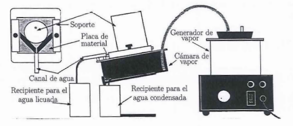

```{r setup, include=FALSE}
knitr::opts_chunk$set(echo = FALSE)
```

# Objetivos

- Determinación del coeficiente de conductividad térmica de algunos materiales.

# Introducción

La corriente calorífica \(J_{q}\) a través de una determinada sección recta, de abscisa \(x\), es directamente proporcional al área de dicha sección recta y al cambio de temperatura por unidad de longitud a lo largo de la barra o gradiente de temperatura; así, podemos escribir:

\begin{equation}
 J_{q} = -k S \frac{\delta \theta}{\delta x} \ \ [W]
\end{equation}

El signo negativo indica que la energía fluye en la dirección en que disminuye la temperatura. La constante de proporcionalidad \(k\) es un parámetro característico de cada material, denominado coeficiente de conductividad térmica, cuyo valor siempre es positivo. En particular, la corriente calorífica que fluye por un material de forma cilíndrica en función de las temperaturas $\theta$ de sus extremos:

\begin{equation}
  J_{q} = k S \frac{\theta_{1} - \theta_{2}}{L} \ \ [W]
\end{equation}

Sabiendo que \(\delta Q = J_{q} \delta t\) podemos decir que:

\begin{equation}
  \Delta Q = k S \frac{\Delta \theta}{h} \Delta t \ \ [J]
\end{equation}

Donde \(S\) es el área transversal a la dirección de flujo de calor, \(\Delta \theta\) es la diferencia de temperatura entre las caras del material, \(h\) es el espesor del material y \(k\) es el coeficiente de conductividad térmica.

Para medir la conductividad térmica de un material es necesario saber la cantidad de calor que fluye por él. Para ello, en el experimento, colocamos el material objeto de estudio entre una cámara de vapor de agua (\(\theta_{1} = 100^{\circ}C\)) y un bloque de hielo (\(\theta_{2} = 0^{\circ}C\)) y medimos la masa \(m\) de hielo derretido: por lo tanto, la cantidad de calor transmitido será \(\Delta Q = m L_{f}\). Sustituyendo se obtiene:

\begin{equation}
  k = \frac{m L_{f} h}{S \Delta \theta \Delta t} \ \ [WK^{-1}m^{-1}]
\end{equation}

siendo \(L_{f} = 80 \ \ cal \ g^{-1}\) el calor latente de fusión del agua y \(\Delta \theta = 100^{\circ}C\). Si llamamos \(R \equiv m / \Delta t\) la masa de hielo derretida por unidad de tiempo, se obtiene:

\begin{equation}
  k = \frac{R L_f h}{S \Delta \theta} \ \ [WK^{-1}m^{-1}]
\end{equation}

# Dispositivo experimental y metodología

## Instrumentación

- Moldes de hielo.
- Placas de distintos materiales: yeso, metacrilato, policarbonato, vidrio y madera.
- Generador de vapor.
- Balanza para pesar la masa de hielo derretido.
- Cámara de vapor con un soporte para la muestra.
- Recipientes para recoger el hielo fundido y el vapor condensado.
- Gomas para conectar el generador de vapor con la cámara.
- Un pie de rey para medir los diámetros de los cilindros de hielo.
- Un cronómetro, para contabilizar el tiempo transcurrido.

## Montaje experimental

Antes de empezar la práctica, es necesario tener preparados los moldes de hielo. Para poder sacar los bloques de hielo de sus moldes con facilidad, sumerjimos el molde en un recipiente con agua templada.

{width="500"}

En principio conectaremos mediante una goma el generador de vapor al primer orificio de la parte superior de la cámara, para que almacene el vapor. Por el segundo orificio se expulsa el vapor condensado. Para cada una de las medidas utilizaremos una placa de distinto material. Una vez bien colocada la placa, esperamos unos segundos a que se haya generado vapor suficiente.

\begin{figure}[H]
  \begin{subfigure}{.31\textwidth}
    \centering
    \includegraphics[width=\linewidth]{figuras/generador_vapor.jpg}
    \caption{Generador de vapor.}
  \end{subfigure}%
  \hfill 
  \begin{subfigure}{.31\textwidth}
    \centering
    \includegraphics[width=\linewidth]{figuras/bloque_hielo.jpg}
    \caption{Hielo.}
  \end{subfigure}%
  \hfill 
  \begin{subfigure}{.31\textwidth}
    \centering
    \includegraphics[width=\linewidth]{figuras/camara_vapor.jpg}
    \caption{Camara de vapor.}
  \end{subfigure}%
  \caption{Dispositivos experimentales 1}
\end{figure}

\begin{figure}[H]
  \begin{subfigure}{.48\textwidth} % Ajusta el ancho para dos figuras
    \centering
    \includegraphics[width=\linewidth]{figuras/placas.jpg}
    \caption{Placas de distinto material.}
  \end{subfigure}%
  \hfill 
  \begin{subfigure}{.48\textwidth} % Ajusta el ancho para dos figuras
    \centering
    \includegraphics[width=\linewidth]{figuras/balanza.jpg}
    \caption{Balanza y recipiente.}
  \end{subfigure}%
  \caption{Dispositivos experimentales 2}
\end{figure}


## Metodología

1. Antes de empezar cada una de las medida medimos el diámetro \(d_0\) del cilindro de hielo. Tras finalizar el tiempo designado para esa placa volvemos a medir el diámetro del cilindro de hielo $d_f$, tomamos como diámetro final la media de ambos diámetros.

2. Pesamos el recipiente vacío en el que vamos a recolectar la masa de hielo fundido.

3. Una vez hayamos colocado correctamente una de las placas de un material determinado, conectamos el generador y esperamos a que haya suficiente vapor almacenado, esto es, hasta que comiencen a caer las primeras gotas de vapor condensado.

4. Colocamos el cilindro sobre la placa (apoyado entre las dos pestañas negras), asegurándonos de que el hielo pueda moverse libremente.

5. Contamos 7 minutos desde que colocamos el bloque de hielo sobre la placa hasta que lo retiramos (\(\Delta t = 7\text{ min}\)).

6. Durante ese tiempo recolectamos la masa de hielo fundido, \(m\), al terminar pesamos el vaso para obtener la masa del conjunto vaso + masa fundida.

7. Realizamos de nuevo el proceso para otra placa de un material distinto, medimos de nuevo el diámetro del cilindro de hielo y repetimos los pasos anteriores.

## Metodología para el análisis de los datos

- A partir de las masas de hielo derretidas en cada una de las experiencias, \(m_n\), donde \(n\) designa cada uno de los experimentos realizados, y el tiempo transcurrido \(\Delta t\), calculamos la velocidad a la que se derrite en cada uno de los casos \(R_n = m_n / \Delta t\).

- A partir de los datos obtenidos, y con la fórmula de la ecuación (5), obtenemos el coeficiente de conductividad térmica \(k_n\) para cada uno de los materiales.

\clearpage

# Medidas y análisis de los datos

La masa del recipiente donde caerá el hielo derretido es de $M_r=106.5$ g. Para obtener los grosores de cada una de las placas utilizadas, teniendo en cuenta que las placas no presentan un grosor uniforme, hemos tomado medidas de este grosor en disintas partes de la placa y hemos considerado como grosor final la media de estas medidas. Además, hemos medido el diámetro del cilindro de hielo antes y despues de cada experiencia, considerando como valor final la media de ambas medidas. Los datos obtenidos se recogen en la siguiente tabla:

```{r}
# Datos recogidos
i <- c(1,2,3,4)

# Medias de los diámetros antes y despues
d0 <- c(80.05, 76.5, 74.8, 73.95)
df <- c(76.5, 74.8, 73.95, 70.5)
d <- c(80.05+76.5, 76.5+74.8, 74.8+73.95, 73.95 + 70.5)/2 #mm

# Medias de los grosores de las placas
h1 <- c(6.55, 6.35, 6.25, 6.35)
h2 <- c(10.2, 9.9, 10.0, 9.85)
h3 <- c(6.3, 7.15, 6.7, 7.75)
h4 <- c(5.85, 5.85, 5.95, 5.90)
h <- c(mean(h1), mean(h2), mean(h3), mean(h4)) #mm

# Tabla
data <- data.frame(i,d0,df,d,h)
colnames(data) <- c("Experimento","$d_0$ / mm","$d_f$ / mm","$d$ / mm","$h$ / mm")
  
knitr::kable(
  data,
  caption="Espesores de las placas y diámetros del bloque de hielo en cada experiencia.",
  booktabs = TRUE,
  escape = FALSE,
  row.names = FALSE,
  align="c"
)
```

A partir de las masas de hielo derretidas $m_n$ en cada una de las experiencias, y el tiempo transcurrido, donde \(\Delta t = 7\) min para todas nuestras experiencias, calculamos la velocidad a la que se derrite en cada uno de los casos mediante la fórmula \(R_n = m_n / \Delta t\). Si además usamos la fórmula de propagación de errores \(\sigma^2 = \sum_i (\partial f / \partial x_i)^2 \sigma_i^2\), la expresión que tenemos que usar para calcular el error en la velocidad es:

\begin{equation*}
\Delta (R_n)^2 = \Big( \frac{\Delta m}{\Delta t} \Big)^2 + \Big( \frac{m}{(\Delta t)^2} \cdot \Delta (\Delta t) \Big)^2
\end{equation*}

donde consideramos $\Delta m = 0.1$ g (la precisión de la balanza) y un error en la medida de tiempos de $\Delta (\Delta t) = 0.5\text{ s}$.

```{r}
# Datos recogidos
mtot <- c(124.3,129.7,128.2, 130.7) #masa con recipiente, gramos
Mrec <- 106.5 #masa del recipiente, gramos
m <- mtot - Mrec #masa de agua fundida, gramos
dt <- 7*60 #s

# Cálculo de las velocidades de fusión
R <- m/dt #g/s
inc_m <- 0.1 #g
inc_t <- 0.5 #s
inc_R <- sqrt((inc_m/dt)^2 + (m/dt^2*inc_t)^2)

# Tabla
data <- data.frame(i,mtot,m,R,inc_R)
colnames(data) <- c("Experimento","$m_{tot}$ / $g$","$m_n$ / $g$", "$R_n$ / $\\frac{g}{s}$", "$\\Delta R_n$ / $\\frac{g}{s}$")
  
knitr::kable(
  data,
  caption="Masa de agua derretida con y sin contar la del recipiente de cada uno de los experimentos. Velocidades a las que se derriten con su error",
  booktabs = TRUE,
  escape = FALSE,
  row.names = FALSE,
  align="c"
)
```

A partir de los datos obtenidos y con la fórmula (5) proporcionada en el marco teórico, obtenemos el coeficiente de conductividad térmica para cada uno de los materiales \(k_n\). Si volvemos a usar la fórmula de propagación de errores, la expresión que tenemos que usar para calcular el error en estas medidas es:

$$
\Delta k^2 = \Big( \frac{L_fh}{S\Delta \theta} \cdot \Delta R \Big)^2 + \Big( \frac{RL_f}{S\Delta \theta} \cdot \Delta h \Big)^2 + \Big( \frac{RL_fh}{S^2\Delta \theta} \cdot \Delta S \Big)^2
$$
donde usamos que como $S = \pi(\frac{d}{2})^2$, entonces $\Delta S = \frac{\pi}{2} d \Delta d$. Además, las incertidumbres en las longitudes las tomaremos como las de la precisión del pie de rey $\Delta h = \Delta d = 0.05$ mm. Recogiendo en una tabla los resultados:

```{r}
# Datos recogidos
h <- h*1e-3 #m
d <- d*1e-3 #m
Lf <- 80 * 4.184 #J/g
incr_theta <- 100 #ºC

inc_d <- 0.05*1e-3 #m
inc_h <- 0.05*1e-3 #m

S <- pi*(d/2)^2 #m^2
inc_S <- pi/2*d*inc_d #m^2

# Calculos de los coeficientes con sus errores
k <- R*Lf*h/(S*incr_theta)

term1 <- ( (Lf * h) / (S * incr_theta) * inc_R )^2
term2 <- ( (R * Lf) / (S * incr_theta) * inc_h )^2
term3 <- ( (R * Lf * h) / (S^2 * incr_theta) * inc_S )^2
inc_k <- sqrt(term1 + term2 + term3)

# Tabla
data <- data.frame(i,k, inc_k)
colnames(data) <- c("Experimento","$k_n$ / $\\frac{W}{mK}$","$\\Delta k_n$ / $\\frac{W}{mK}$")
  
knitr::kable(
  data,
  caption="Coeficientes de conductividad térmica para cada material con su error",
  booktabs = TRUE,
  escape = FALSE,
  row.names = FALSE,
  align="c"
)
```

# Resultados
Expresando correctamente los resultado del apartado anterior llegamos a que:
\[
k_1 = `r round(k[1],4)` \pm `r signif(inc_k[1],2)` \ \frac{W}{mK}
\]
\[
k_2 = `r round(k[2],4)` \pm `r signif(inc_k[2],2)` \ \frac{W}{mK}
\]
\[
k_3 = `r round(k[3],4)` \pm `r signif(inc_k[3],2)` \ \frac{W}{mK}
\]
\[
k_4 = `r round(k[4],4)` \pm `r signif(inc_k[4],2)` \ \frac{W}{mK}
\]

Mientras que los valores teóricos ofrecidos por la literatura para los materiales de interés son:

- Yeso
\[
k_{\text{Yeso}} \quad\text{dentro del rango}\quad 0.25-0.5\ \frac{W}{mK}
\]

- Metacrilato
\[
k_{\text{Metacrilato}} = 0.19\ \frac{W}{mK}
\]

- Vidrio
\[
k_{\text{Vidrio}} \quad\text{dentro del rango}\quad 0.6-1\ \frac{W}{mK}
\]

- Madera
\[
k_{\text{Madera}} \quad\text{dentro del rango}\quad 0.13-0.29\ \frac{W}{mK}
\]

- Policarbonato
\[
k_{\text{Policarbonato}} = 0.21\ \frac{W}{mK}
\]

\clearpage

# Discusión y conclusiones de los resultados

Vemos que los resultados parecen corresponder con los materiales siguientes:

- $k_1$: Metacrilato
- $k_2$: Yeso

Para los materiales 3 y 4 obtenemos valores similares para $k_n$, pero por la apariencia de las placas creemos que deben corresponder a:

- $k_3$: Policarbonato
- $k_4$: Madera

Por lo general podemos considerar que los dos primeros resultados son bastante buenos, especialmente teniendo en cuenta que la literatura no ofrece valores fijos para estos coeficientes, sino que suele dar rangos dentro de los cuales puede encontrarse el valor de $k$. En cuanto a los materiales de las placas 3 y 4 los resultados son peores, pero esto es hasta cierto punto esperable puesto que conforme avanza el experimento el cilindro se va deformando ligeramente al derretirse. De nuevo, los valores teóricos con los que comparamos tampoco son muy certeros, por lo que los resultados experimentales obtenidos son hasta cierto punto satisfactorios.

En cuanto a las posibles fuentes de error, hay varios factores a considerar. En primer lugar, los tiempos no fueron de exactamente 7 minutos para todas las experiencias, aunque se procuró que $\Delta t$ se mantuviera lo más próximo posible a este valor. Por otro lado, cierta parte del agua que se fundía quedaba en la superficie del cilindro, y otra pequeña porción de agua líquida quedaba en la superficie de la placa a estudiar, por lo que las medidas de masa fundida son algo menores que la verdadera masa fundida en cada experiencia. Otro factor a tener en cuenta es el hecho de que la base del cilindro de hielo no era completamente plana ni circular, por lo que al asumir que la superficie en contacto es un círculo se está realizando una aproximación que no es del todo precisa.  

También es relevante el hecho de que no se disponía de una sonda que midiera la temperatura en el interior de la cámara de vapor, por lo que es imposible confirmar si realmente había $100^\circ$C. Además, a la hora de realizar las medidas del diámetro del cilindro, nuestro pie de rey se hundía ligeramente en la superficie del bloque de hielo, fundiéndolo y disminuyendo esta longitud. Esto provocaba una diferencia entre el diámetro medido a cierta altura y el del resto del bloque de hielo.