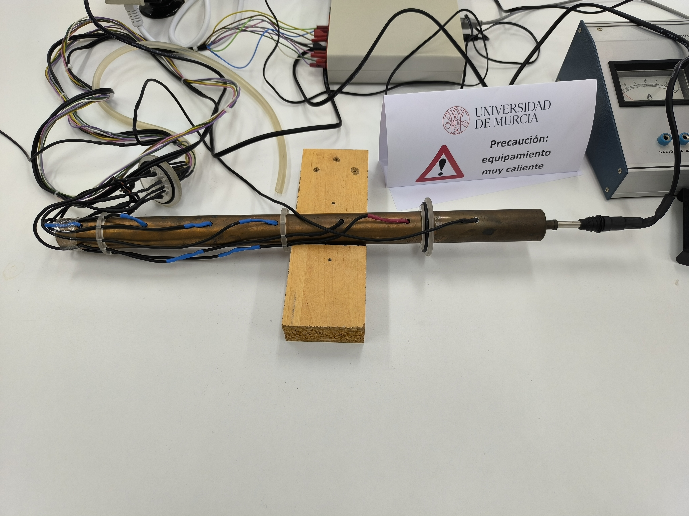
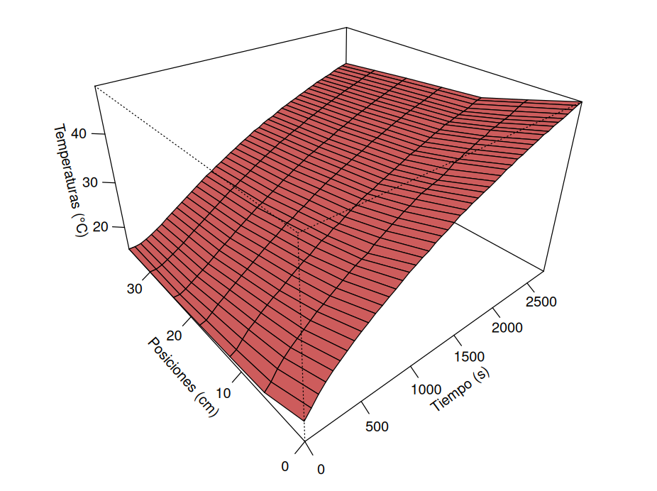

```{r setup, include=FALSE}
knitr::opts_chunk$set(echo = FALSE)
```

# Objetivos

- Estudiar el fenómeno del transporte del calor en una barra de cobre.
- Obtener el valor de la conductividad térmica del cobre y del coeficiente de pérdidas laterales de la barra.

# Introducción

El estudio de la propagación del calor en una barra metálica lleva a la siguiente ecuación en derivadas parciales, que describe el comportamiento del campo térmico $\theta(x,t)$ en una barra de sección circular con radio r:
\begin{align}
\frac{\partial^2\theta}{\partial x^2}= \frac{c\rho}{k}\frac{\partial \theta}{\partial t}+\frac{2h}{kr}(\theta-\theta_0)
\end{align}
donde $\rho$ es la densidad del material de la barra, $c$ su calor específico, $k$ la conductividad térmica del material y $h$ el coeficiente de pérdidas laterales. 

Si definimos:
\begin{align*}
T &= \theta-\theta_a \\
Y &= \frac{T''}{T},\quad T''=\frac{\partial^2 T}{\partial x^2} \\
X &= \frac{\dot{T}}{T}, \quad \dot{T}=\frac{\partial T}{\partial t} \\
K &= \frac{c\rho}{k} \\
H &= \frac{2h}{rk}
\end{align*}

Podemos reescribir la ecuación (1) como:
\begin{align}
  Y=KX+H
\end{align}

Para poder emplear la ecuación obtenida podemos aproximar las derivadas $T'',\dot{T}$ mediante incrementos finitos, haciendo:
\begin{align}
T''_{ji}&=\frac{T(x_i+2\Delta x_i, t_j)-2T(x_i+\Delta x_i, t_j)+T(x_i, t_j)}{(\Delta x)^2}\\
\dot{T}_{ji}&=\frac{T(x_i,t_j+\Delta t)-T(x_i,t_j)}{\Delta t}
\end{align}

De esta manera podemos utilizar la ecuación (2) para realizar un ajuste lineal con el que obtenemos $K,H$. Finalmente, usando los datos conocidos para el cobre $\rho=8.96\ \frac{g}{cm^3}$, $c=22.6+10^{-2}T\ \frac{J}{mol\ K}$ podemos obtener el valor de $k$.

# Dispositivo experimental y metodología

## Instrumentación

- Barra de cobre con sensores de temperatura.
- Sonda térmica para medir la temperatura ambiente.
- Ordenador con el software necesario para registrar las temperaturas.
- Resistencia calefactora para calentar el extremo de la barra.

## Montaje experimental

{width="480"}

\begin{figure}
  \begin{subfigure}{.5\textwidth}
    \centering
    \includegraphics[width=\linewidth]{figuras/sonda.jpg}
    \caption{Sonda térmica para registrar la temperatura ambiente.}
  \end{subfigure}%
  \hfill 
  \begin{subfigure}{.5\textwidth}
    \centering
    \includegraphics[width=\linewidth]{figuras/software.jpg}
    \caption{Software para registrar temperaturas.}
  \end{subfigure}%
  \caption{Dispositivos experimentales}
\end{figure}

\clearpage
 
# Medidas
```{r}
# Raw data
datos <- read.table("~/Desktop/FisTerm/Practica6/version_def/gonzmolpi.txt", header = FALSE)

datos <- as.matrix(datos)

tiempo <- datos[,1]
T_ambiente <- datos[,2]

datos[,6] <- (datos[,5]+datos[,7])/2
datos[,8] <- (datos[,7]+datos[,9])/2

```

En primer lugar, podemos visualizar los datos registrados por los sensores:
```{r, fig.width=7, fig.height=6,out.height="37.5%", fig.align='center', fig.cap="Evolución espacio-temporal de la temperatura en la barra"}
x <- c(0,6,12,18,24,30,36)
temperaturas <- datos[,3:9]

# persp(tiempo,x,temperaturas,xlab="Tiempo (s)",ylab="Posiciones (cm)",zlab="Temperaturas (°C)",expand=0.6,theta=-40,phi=30,ticktype = "detailed",col="indianred")
```

{width="400"}

```{r, out.width="60%", fig.align='center', fig.cap="Evolución temporal de la temperatura en la barra. Cada color corresponde a un sensor en una posición distinta."}
plot(tiempo,temperaturas[,1],xlab="Tiempo (s)",ylab="Temperaturas (°C)",type="l",col="coral")
lines(tiempo,temperaturas[,2],col="lightblue")
lines(tiempo,temperaturas[,3],col="green3")
lines(tiempo,temperaturas[,4],col="purple3")
lines(tiempo,temperaturas[,5],col="pink")
lines(tiempo,temperaturas[,6],col="red3")
lines(tiempo,temperaturas[,7],col="orange1")

legend("topleft", legend = c("Sensor 2", "Sensor 3", "Sensor 4", "Sensor 5", "Sensor 6", "Sensor 7", "Sensor 8"), 
       col = c("coral", "lightblue", "green3", "purple3", "pink", "red3", "orange1"), lwd = 2)
```

\clearpage

Si recogemos los datos registrados por el software en una tabla obtenemos lo siguiente:

```{r}
# Tabla
data <- data.frame(tiempo[13:47],datos[13:47,3:9])
colnames(data) <- c("t(s)","$\\theta_1(^{\\circ} C)$","$\\theta_2(^{\\circ} C)$","$\\theta_3(^{\\circ} C)$","$\\theta_4 (^{\\circ} C)$","$\\theta_5(^{\\circ} C)$","$\\theta_6( ^{\\circ} C)$","$\\theta_7 (^{\\circ} C$)")
  
knitr::kable(
  data,
  caption="Temperatura registrada por cada sensor, a partir del minuto 12 desde el inicio. Tiempo entre medidas 60 segundos.",
  booktabs = TRUE,
  escape = FALSE,
  row.names = FALSE,
  align="c"
)
```

\clearpage

En cuanto a las diferencias de temperatura respecto a la ambiente $\theta_a$, $T_i=\theta_i-\theta_a$, tenemos la siguiente tabla:

```{r}
temperaturas <- temperaturas[13:47,] - matrix(T_ambiente[13:47], nrow = 35, ncol = 7, byrow = FALSE)

# Tabla
data <- data.frame(tiempo[13:47],temperaturas)
colnames(data) <- c("t(s)","$T_1(^{\\circ} C)$","$T_2(^{\\circ} C)$","$T_3(^{\\circ} C)$","$T_4 (^{\\circ} C)$","$T_5(^{\\circ} C)$","$T_6( ^{\\circ} C)$","$T_7 (^{\\circ} C$)")
  
knitr::kable(
  data,
  caption="Diferencia de temperatura registrada por cada sensor, a partir del minuto 12 desde el inicio. Tiempo entre medidas 60 segundos.",
  booktabs = TRUE,
  escape = FALSE,
  row.names = FALSE,
  align="c"
)
```

```{r}
# Valores de constantes
rho <- 8.96 # g/m^3
T0 <- mean(T_ambiente)+273
c <- 22.6 + 10^(-2)*T0
```

\clearpage

# Análisis

Según se ha mencionado en la introducción, aproximaremos los valores de $Y=\frac{T''}{T}$ y de $X=\frac{\dot{T}}{T}$ empleando diferencias finitas con $\Delta x = 6cm$, $\Delta t = 120s$.

En el caso de Y aproximamos los valores $Y_i$:
\begin{align*}
Y_i=\frac{T_i''}{T_i}\approx\frac{T_{i+2}-2T_{i+1}+T_i}{(\Delta x)^2}\frac{1}{T_i}
\end{align*}

para $i=1,2,3,4,5$ y tomamos $Y=\frac{\sum_{i=1}^5 Y_i}{5}$.

En el caso de X aproximamos los valores $X_i$:
\begin{align*}
X_{i}=\frac{\dot{T}_i}{T_i}\approx\frac{T_i(t+\Delta t)-T_i(t)}{\Delta t}\frac{1}{T_i(t)}
\end{align*}

para $i=1,2,3,4$ (las posiciones más cercanas al foco de calor). Finalmente tomamos $X=\frac{\sum_{i=1}^4 X_{i}}{4}$

```{r}
# T''
T_segunda <- matrix(0,ncol=5,nrow=35)

for(j in 1:5){
  T_segunda[,j] <- (temperaturas[,j+2]-2*temperaturas[,j+1]+temperaturas[,j])/(6^2) 
}

YY <- T_segunda / temperaturas[,1:5]
Y <- (YY[,1]+YY[,2]+YY[,3]+YY[,4]+YY[,5])/5

Y <- Y[1:33]

# T dot
T_dot <- matrix(ncol=7,nrow=33)
for(j in 1:33){
  T_dot[j,] <- (temperaturas[j+2,]-temperaturas[j,])/120
}

XX <- T_dot / temperaturas[1:33,]
X <- (XX[,1]+XX[,2]+XX[,3]+XX[,4])/4
```

Obtenemos así los siguientes valores:

```{r}
# Tabla
data <- data.frame(tiempo[13:45],Y,X)
colnames(data) <- c("t(s)","$Y=\\frac{T''}{T}$ (cm$^{-2}$)", "$X=\\frac{\\dot{T}}{T}$ ($s^{-1}$)")
  
knitr::kable(
  data,
  caption="Valores aproximados de X e Y para distintos tiempos.",
  booktabs = TRUE,
  escape = FALSE,
  row.names = FALSE,
  align="c"
)
```

Con estos datos realizamos un ajuste lineal:

```{r, echo=FALSE,  out.width= "90%", fig.align='center', fig.cap="Ajuste de Y sobre X"}

# Ajuste lineal
modelo_lineal <- lm(Y ~ X)
resumen <- summary(modelo_lineal)
pendiente <- modelo_lineal$coefficients[[2]]
inc_pendiente <- resumen$coefficients[2,2]
ordenada <- modelo_lineal$coefficients[[1]]
inc_ordenada <- resumen$coefficients[1,2]

R2 <- resumen$r.squared

# Graficamos los datos y la línea de ajuste

titulo <- "Ajuste lineal de Y sobre X"
plot(X,Y, main = titulo, ylab =expression(Y ~ (cm^{-2})), xlab =expression(X ~ (s^{-1})))
abline(modelo_lineal, col = "coral")
```

y obtenemos los siguientes resultados:

- Pendiente: $K=`r pendiente`\ \frac{s}{cm^2}$

- Incertidumbre en la pendiente: $\Delta K=`r inc_pendiente` \ \frac{s}{cm^2}$

- Ordenada: $H=`r ordenada`\ \frac{1}{cm^2}$

- Incertidumbre en la ordenada: $\Delta H=`r inc_ordenada`\ \frac{1}{cm^2}$

con un coeficiente de correlación $R^2=`r R2`$.

Además, tenemos que $\rho=8.96\ \frac{g}{cm^3}$, $c=22.6+10^{-2}T_a\approx`r c`\ \frac{J}{mol\ K}$, y como el peso atómico del cobre es $63.55\ \frac{g}{mol}$, se obtienen los siguientes resultados:

```{r}
k <- rho*(c/63.55)/pendiente
h <- k*ordenada/2
```

\begin{align*}
k &= \frac{\rho c}{K}= `r k` \ \frac{W}{cm\ K}\\
h &= \frac{Hrk}{2} = `r h` \ \frac{W}{cm^2\ K}
\end{align*}

```{r}
dk <- rho*(c/63.55)*inc_pendiente/pendiente^2
dh <- sqrt((dk*ordenada/2)^2+(k*inc_ordenada/2)^2)
```

y calculando las correspondientes incertidumbres teniendo en cuenta la propagación de errores tenemos:
\begin{align*}
\Delta k = \frac{\rho c\Delta K}{K^2} &= `r dk` \ \frac{W}{cm\ K}\\
\Delta h = \sqrt{\Big(\frac{Hr\Delta k}{2}\Big)^2 +  \Big(\frac{rk\Delta H}{2}\Big)^2 } &= `r dh` \ \frac{W}{cm^2\ K}
\end{align*}


# Resultados

Finalmente, los valores obtenidos son:
\[
k = `r round(k*100)` \pm `r signif(dk*100,2)` \ \frac{W}{m\ K}
\]

\[
h = `r round(h*1e4, 2)` \pm `r signif(dh*1e4, 2)`\ \frac{W}{m^2\ K}
\]

el valor comúnmente aceptado para la conductividad térmica del cobre es de $k\approx 385\ \frac{W}{m\ K}$.

# Discusión y conclusiones
Tanto en la base teórica como en el experimento mismo existen diversas fuentes de error que afectan a los resultados obtenidos y deben ser tenidas en cuenta. Primeramente, tengamos en cuenta que el ajuste lineal del que se obtienen tanto la conductividad térmica $k$ como el coeficiente $h$ de pérdidas laterales se realiza sobre valores de ciertas derivadas que son aproximados por diferencias finitas. Respecto a estos valores, hemos de destacar que varían considerablemente dependiendo de las temperaturas que tomamos de según qué sensores térmicos. Es decir, que los valores $X$ varían casi en el doble de su valor si pasamos de considerar solamente los valores $X_i$ de los sensores más cercanos al dispositivo térmico a considerar todos los posibles a la hora de realizar la media para calcular los valores $X$. Además, hemos podido comprobar que realizar el cálculo de los $X_i$ mediante la aproximación de las derivadas de la temperatura sustituyendo $T_i(t+\Delta t)$ por $T_i(t+2\Delta t)$ (o incluso $T_i(t+3\Delta t)$) mejora el coeficiente de regresión del ajuste lineal. Todo esto sugiere la existencia de otras fuentes de error más allá del método de aproximación.

En cuanto a las condiciones del experimento, estas difieren de las esperadas para llevarlo a cabo. Los sensores $5$ y $7$ correspondientes a las medidas de $\theta_4$ y $\theta_6$ estaban averiados por algún motivo, por lo que hemos tenido que obtener estos valores mediante interpolación por la media de los valores $\theta_3$ con $\theta_5$, y $\theta_5$ con $\theta_7$, respectivamente. Esto puede reducir la fiabilidad de las medidas realizadas por el resto de sensores, que pudieran estar averiados también pero con un error suficientemente pequeño como para ser pasado por alto, aunque este afecte a los resultados obtenidos. Además, otras condiciones como la composición de los materiales involucrados pudo haber afectado a los resultados, desviándolos de los proporcionados por la literatura. Por ejemplo, la barra de cobre empleada pudo haber estado oxidada o deteriorada, lo que afectaría, a priori, a los parámetros que determinan el transporte del calor a través de la misma. Uno también podría pensar en que el soporte de madera y los de plástico de la figura $1$ pudieron haber afectado a los resultados de un modo análogo.

También debemos mencionar que, aunque el guion asegurase una distancia de $6cm$ entre cada sensor en la barra de cobre, no se pidieron las medidas pertinentes para comprobarlo. Finalmente, queremos destacar que en el guion se menciona explícitamente que el extremo de la barra de cobre contrario al que se calienta con el dispositivo térmico debe estar en contacto con un baño de agua aislado térmicamente. Esto no fue así en el laboratorio, donde dicho extremo quedó expuesto al aire a temperatura ambiente.

De todas formas, el experimento proporciona un valor razonable de la conductividad térmica del cobre mediante un método de aproximación simple y elemental.

