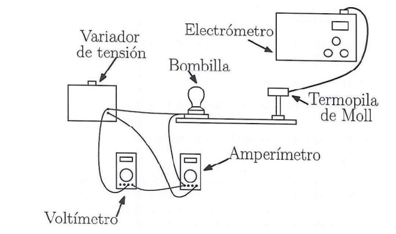

```{r setup, include=FALSE}
knitr::opts_chunk$set(echo = FALSE)
```

# Objetivos

- Comprobación de la ley de Stefan-Boltzmann.
- Comprobación de la primera ley de Lambert.

# Marco Teórico

## Ley de Stefan-Boltzmann

La ley de Stefan-Boltzmann establece que la cantidad total de potencia emisiva por unidad de área que emite una superficie a la temperatura \( T \) por un cuerpo es proporcional a la cuarta potencia de la temperatura absoluta del mismo:

\begin{equation}
E = \epsilon \sigma T^4 \quad [W/m^2]
\end{equation}

donde \( \epsilon \) es el factor de emisión o emisividad, el cual depende de la temperatura y del estado de la superficie del cuerpo (podemos aproximarlo a 1). El factor \( \sigma \) es la constante de Stefan-Boltzmann, donde \( \sigma = 5.67 \times 10^{-8} \, \text{Wm}^{-2}\text{K}^{-4} \).

Como consecuencia, de acuerdo con la expresión anterior, la cantidad neta de calor que un cuerpo irradia hacia el exterior por unidad de tiempo vendrá dada por:

\begin{equation}
P = \frac{dq}{dt} = -\epsilon \sigma S (T^4 - T_a^4) \quad [W]
\end{equation}

donde el signo negativo hace referencia a que el contenido energético del cuerpo disminuye al transcurrir el tiempo si la emisión es positiva, y siendo \( T_a \) la temperatura del ambiente en el que se encuentra el cuerpo.

En uno de los experimentos, para la comprobación de la ley de Stefan-Boltzmann, se estudiará el flujo de energía disipado por el filamento de tungsteno de una bombilla eléctrica, cuando se le suministra una determinada potencia. A su vez, la fuerza electromotriz de la termopila Moll, \( V_{tp} \), es proporcional al flujo de energía que incide sobre ella. Se cumplirá que:

\begin{equation}
V_{tp} \propto E \sim T^4 - T_a^4 \implies V_{tp} \propto T^4
\end{equation}

Como vemos, hemos despreciado el término \( T_a^4 \ll 1 \).

La determinación de la temperatura del filamento para una potencia dada se obtendrá suponiendo que el incremento en la resistencia del filamento de tungsteno es lineal con la temperatura según la ley (para metales):

\begin{equation}
R(t) = R_0 (1 + \alpha t + \beta t^2) \quad [\Omega]
\end{equation}

donde \( t \) es la temperatura en grados centígrados, \( R_0 \) es la resistencia eléctrica del filamento a \( 0^\circ C \) y \( \alpha \) y \( \beta \) son constantes eléctricas, que para el tungsteno valen, \( \alpha = 4.82 \times 10^{-3} \, K^{-1} \) y \( \beta = 6.76 \times 10^{-7} \, K^{-2} \).

A su vez, la resistencia \( R_0 \) se puede medir directamente colocando la lámpara a \( 0^\circ C \), o bien estimarla a partir de la resistencia \( R_a \) a temperatura ambiente \( T_a \):

\begin{equation}
R_0 = \frac{R_a}{1 + \alpha T_a + \beta T_a^2}
\end{equation}

Despejando de (4) y usando la equivalencia entre grados Kelvin y centígrados se obtiene la temperatura absoluta del filamento como función de su resistencia:

\begin{equation}
T = 273,15 + \frac{-R_0 \alpha \pm \sqrt{R_0^2 \alpha^2 - 4 R_0 \beta (R_0 - R)}}{2 R_0 \beta} \quad \text{[K]}
\end{equation}

A su vez, la resistencia de la lámpara se puede conocer midiendo la tensión de alimentación \( V \) y la corriente \( I \) que circula por ella:

\begin{equation}
R = \frac{V}{I} \quad [\Omega]
\end{equation}

## Ley de Lambert

Otro de los aspectos a estudiar es la dependencia de la energía luminosa recibida por una superficie con la inversa del cuadrado de la distancia al foco emisor. La iluminancia, \( \mathcal{E} \), sobre una superficie por un foco puntual viene dada por:

\begin{equation}
\mathcal{E} = \frac{d\psi}{dS} = \mathcal{I} \frac{d\Omega}{dS}\quad [W/m^2]
\end{equation}

siendo \( d\psi \) el flujo radiante correspondiente al elemento de superficie \( dS \), \( d\Omega \) el diferencial del ángulo sólido e \( \mathcal{I} \) la intensidad luminosa de la fuente. Si se tiene en cuenta la expresión del ángulo sólido, la ecuación anterior se transforma en:

\begin{equation}
\mathcal{E} = \frac{\mathcal{I}}{r^2} \cos \theta \quad [W/m^2]
\end{equation}

que constituye la llamada Primera Ley de Lambert, siendo \( \theta \) el ángulo de inclinación del foco luminoso sobre la superficie receptora. Si en nuestro caso la lámpara se encuentra a la misma altura que la termopila, \( \theta = 0 \) y, por lo tanto:

\begin{equation}
\mathcal{E} = \frac{\mathcal{I}}{r^2} \quad [W/m^2]
\end{equation}

El voltaje de la termopila Moll será:

\begin{equation}
V_{tp} \propto \mathcal{E} \rightarrow V_{tp} \propto r^{-2}
\end{equation}

# Dispositivo experimental y metodología

## Instrumentación

- Un amperímetro.
- Un voltímetro.
- Una termopila de Moll junto a lector de radiación captada.
- Un carril donde el detector térmico tenga una posición variable.
- Una cinta métrica.
- Un potenciómetro.
- Una bombilla y un portalámparas.

## Montaje experimental

Estudiaremos la ley de Stefan-Boltzmann y la ley de Lambert a partir de la radiación emitida por una bombilla. Se coloca la bombilla sobre el portalámparas y éste a su vez sobre el carril. Se sitúa la termopila de Moll a una distancia determinada de la bombilla. Como se ha indicado anteriormente, procuraremos apartarnos cierta distancia para no influir en la toma de medidas.

Una cinta métrica estará dispuesta sobre el carril, para así poder medir las distintas distancias del detector con respecto a la bombilla. Adicionalmente, se dispondrá de una regla milimetrada para verificar que las distancias entre bombilla y detector son las deseadas. El detector térmico estará conectado al lector y la bombilla al amperímetro y al voltímetro, tal y como se muestra en la figura.

{width="500"}
 
\begin{figure}[H]
  \begin{subfigure}{.31\textwidth}
    \centering
    \includegraphics[width=\linewidth]{figuras/variador_tension.jpg}
    \caption{Variador de tensión y multímetros.}
  \end{subfigure}%
  \hfill 
  \begin{subfigure}{.31\textwidth}
    \centering
    \includegraphics[width=\linewidth]{figuras/bombilla_termopila.jpg}
    \caption{Bombilla y termopila de Moll.}
  \end{subfigure}%
  \hfill 
  \begin{subfigure}{.31\textwidth}
    \centering
    \includegraphics[width=\linewidth]{figuras/electrometro.jpg}
    \caption{Electrómetro.}
  \end{subfigure}%
  \caption{Dispositivos experimentales}
\end{figure}

## Metodología

1. Trabajaremos con la radiación emitida por una bombilla. En principio, para no quemar el filamento de la bombilla, no sobrepasaremos los 190 V.

2. Debemos medir la resistencia de la bombilla a temperatura ambiente, \( R_a \). Para ello usaremos un multímetro.

3. Ajustamos la potencia suministrada a la bombilla, registrando el voltaje y la intensidad.

4. Para una potencia fija, variamos la distancia del detector desde 10 cm hasta 30 cm, moviendo el detector 5 cm cada vez. Anotamos el valor de voltaje medido por la termopila para las distintas distancia.

5. Repetimos el mismo proceso para seis potencias distintas. La potencia se controla a través de la fuente de tensión, que se aumenta a intervalos de 30 voltios. 

## Procedimiento para el análisis de los datos

1. Confeccionamos una tabla donde reflejamos la intensidad \( I \) y voltaje \( V \) aplicados sobre el filamento de la bombilla; el voltaje medido por la termopila \( V_{tp} \), la potencia \( P \) y la distancia de la termopila a la bombilla.

2. Deducción de \( T \) para cada una de las medidas a partir de la fórmula (6).

3. Comprobación gráfica de la ley de Stefan-Boltzmann: representamos \( \ln(V_{tp}) \) frente a \( \ln(T) \) para cada una de las distancias. Como podremos comprobar, la pendiente de las rectas obtenidas debe ser un valor próximo a 4.

4. Comprobación gráfica de la Primera Ley de Lambert: tomamos los datos (voltaje, potencia y voltaje de la termopila) a distintas distancias, con la condición de que todos éstos corresponden a una misma intensidad. Representamos \( \ln(V_{tp}) \) frente a \( \ln(d) \) para cada una de las intensidades. Como podremos comprobar, la pendiente de las rectas obtenidas debe ser un valor próximo a -2.

\clearpage

# Medidas y analisis de los datos
```{r}
# Datos recogidos
Ra <- 97.6 # Ohmios
err_Ra<- 0.5
Ta <- 19.2 # ºC
err_Ta <- 0.1

# Cálculo de R0
alpha <- 4.82*10^(-3)
betha <- 6.76*10^(-7) # Hay una función que se llama beta. Mejor llamarla así
R0 <- Ra/(1 + alpha*Ta + betha*Ta^2)
err_R0 <- sqrt((1/(1 + alpha*Ta + betha*Ta^2)*err_Ra)^2 + (Ra/(1 + alpha*Ta + betha*Ta^2)^2*(alpha + 2*betha*Ta)*err_Ta)^2)
```

En el laboratorio pudimos medir con un multímetro el valor de la resistencia de la bombilla a temperatura ambiente \( T_a = 19.2 \ ^\circ C\), obteniendo un valor de \( R_a = 97.6 \ \Omega \), para el que consideraremos una incertidumbre $\Delta R_a = 0.5 \ \Omega$. Por tanto, el valor de la resistencia eléctrica del filamento para el tungsteno a \( 0 ^\circ C\) usando la formula (5) es $R_0 =`r R0` \ \Omega$. Si además empleamos la fórmula de propagación de errores \(\sigma^2 = \sum_i (\partial f / \partial x_i)^2 \sigma_i^2\), obtenemos que la incertidumbre en el cálculo de esta resistencia viene dada por la expresión:
\[
\Delta R_0^2 = \Big( \frac{1}{1 + \alpha T_a + \beta T_a^2} \cdot \Delta R_a\Big)^2 + \Big(\frac{R_a}{(1 + \alpha T_a + \beta T_a^2)^2} \cdot (\alpha + 2 \beta T_a) \cdot \Delta T_a \Big)^2 
\]
donde tomaremos como error en la medición de la temperatura ambiente \(\Delta T_a = 0.1 \ ^\circ C\). Finalmente:
\[
R_0 = `r round(R0,2)` \pm `r signif(err_R0,2)` \ \Omega
\]

En cuanto a la incertidumbre en la medida de voltajes, los voltímetros empleados ofrecían una precisión de $\Delta V = 0.1\  V$, mientras que el amperímetro tenía una sensibilidad $\Delta I =0.01\ A$.

Antes de empezar hemos de comentar algunos aspectos claves que influyeron en la realización de la práctica. Para empezar, el voltímetro que medía el voltaje $V$ aplicado sobre el filamento de la bombilla no estaba perfectamente calibrado, mostrando un error inicial de $V_{err} = 2.0 \ \text{V}$ que se ha tenido en cuenta a la hora de registrar los datos. Con respecto al voltaje medido por la termopila $V_{tp}$, este aparato tiene una sensibilidad limitada, y el entorno donde se realizó el experimento no era el ideal para el funcionamiento de este aparato. Profundizaremos más sobre estas cuestiones en las discusiones de los resultados.

## Comprobación de la ley de Stefan-Boltzmann

En primer lugar, los voltajes e intensidades registrados en el circuito de la bombilla fueron los siguientes:

```{r}
# Datos recogidos
i <- c(1,2,3,4,5,6)
V <- c(32.2, 62.0, 92.2, 122.1, 152.2, 182.5) - 2 #Voltios
I <- c(0.08, 0.10, 0.12, 0.14, 0.15, 0.17) #Amperios
P <- V*I #Vatios

# Función vectorizada para calcular la temperatura del filamento
calcular_temperatura_vectorial <- function(R, R0, alpha, betha) {
  raiz <- sqrt(R0^2*alpha^2-4*R0*betha*(R0-R))
  temperaturas <- 273.15+(raiz - R0*alpha)/(2*R0*betha)
  
  temperaturas <- 273.15 + 1/(2*betha)*(sqrt(alpha^2+4*betha*(R/R0-1))-alpha)
  
  return(temperaturas)
}

# Calculamos la temperatura
R <- V/I
T <- calcular_temperatura_vectorial(R, R0, alpha, betha)

# Tabla
data <- data.frame(i,V,I,P,R, T)
colnames(data) <- c("Medida","$V / V$", "$I / A$", "$P / W$","$R/\\Omega$", "$T / K$")
  
knitr::kable(
  data,
  caption="Voltajes e intensidades registrados junto a potencia, resistencia y temperatura calculadas",
  booktabs = TRUE,
  escape = FALSE,
  row.names = FALSE,
  align="c"
)
```


Vamos a hacer un ejemplo de lo que estamos buscando con los datos recogidos para la distancia $\text{d} = 10 \ \text{cm}$. Los datos recogidos para esta distancia son los siguientes:

```{r}
# Datos recogidos
Vtp1 <- c(0.02, 0.16, 0.44, 0.79, 1.18, 1.74) # Voltios

# Tabla
data <- data.frame(i,V,I,Vtp1,T)
colnames(data) <- c("Medida","$V / V$", "$I / A$", "$V_{tp} / V$", "$T / K$")
  
knitr::kable(
  data,
  caption="Datos recogidos para la distancia d = 10 cm",
  booktabs = TRUE,
  escape = FALSE,
  row.names = FALSE,
  align="c"
)
```

\clearpage

Si hacemos un ajuste lineal de \( \ln(V_{tp}) \) frente a \( \ln(T) \) para esta distancia:

```{r, echo=FALSE,  out.width= "70%", fig.align='center', fig.cap="Ajuste lineal de ln($V_{tp}$) sobre ln($T$) para d = 10 cm"}
# Datos recogidos
lnVtp1 <- log(Vtp1)
lnT <- log(T)

# Ajuste lineal
modelo_lineal <- lm(lnVtp1 ~ lnT)
resumen <- summary(modelo_lineal)
pendiente <- modelo_lineal$coefficients[[2]]
inc_pendiente <- resumen$coefficients[2,2]
ordenada <- modelo_lineal$coefficients[[1]]
inc_ordenada <- resumen$coefficients[1,2]

# Graficamos los datos y la línea de ajuste

titulo <- expression("Ajuste lineal de "~ln(V[tp])~" sobre "~ln(T)~" para d = 10 cm")
plot(lnT,lnVtp1, main = titulo, ylab =expression(ln(V[tp])), xlab =expression(ln(T)))
abline(modelo_lineal, col = "coral")
```
donde obtenemos del ajuste lineal:

- Pendiente: $m=`r pendiente`$

- Incertidumbre en la pendiente: $\Delta m=`r inc_pendiente`$

En teoría, la pendiente de la recta obtenida en el ajuste debería de tomar un valor próximo a $4$. Para el caso de la distancia $\text{d} = 10 \ \text{cm}$, el $4$ no está en el intervalo de confianza, pero aún así podemos dar como aproximadamente válida la comprobación gráfica de la ley de Stefan-Boltzmann dadas las condiciones del laboratorio y las posibles fuentes de error externas. Además, como se mencionará en las discusiones de los resultados, los aparatos de medición utilizados en el experimento dieron algunos problemas.

En cuanto al resto de distancias para las que se registaron datos, notemos que lo único que varía en las tablas asociadas a cada distancia es la columna en la que se recoge el valor $V_{tp}$, pues el voltaje suministrado al circuito de la bombilla se mantuvo constante en las distintas medidas, y, por ende, la columna de temperaturas también coincide para todas las distancias. Una vez dicho esto, los datos registrados para $V_{tp}$ para cada distancia son los siguientes:

```{r}
# Datos recogidos
Vtp2 <- c(0.02, 0.09, 0.24, 0.43, 0.64, 0.94)
Vtp3 <- c(0.01, 0.06, 0.14, 0.26, 0.39, 0.58)
Vtp4 <- c(0.01, 0.04, 0.09, 0.17, 0.26, 0.38)
Vtp5 <- c(0.01, 0.03, 0.06, 0.12, 0.18, 0.27)

# Tabla
data <- data.frame(i, P, Vtp1,Vtp2,Vtp3,Vtp4,Vtp5, T)
colnames(data) <- c("Medida","P / W","$V_{tp_1}$ / V","$V_{tp_2}$ / V","$V_{tp_3}$ / V","$V_{tp_4}$ / V","$V_{tp_5}$ / V", "T / K")
  
knitr::kable(
  data,
  caption="Datos recogidos para distintas distancias",
  booktabs = TRUE,
  escape = FALSE,
  row.names = FALSE,
  align="c"
)
```

Donde $V_{tp_1}$ corresponde a la distancia $d=10\ cm$, $V_{tp_2}$ a la distancia $d=15\ cm$ y así sucesivamente.

\clearpage

Y haciendo el ajuste lineal para cada una de las distancias obtenemos los siguientes resultados:


```{r, echo=FALSE, out.width= "90%", fig.align='center', fig.cap="Ajuste lineal de $\\ln(V_{tp})$ sobre $\\ln(T)$ a distintas distancias"}
# Datos recogidos
lnVtp2 <- log(Vtp2)
lnVtp3 <- log(Vtp3)
lnVtp4 <- log(Vtp4)
lnVtp5 <- log(Vtp5)

# Ajuste lineal 2
modelo_lineal_2 <- lm(lnVtp2 ~ lnT)
resumen_2 <- summary(modelo_lineal_2)
pendiente_2 <- modelo_lineal_2$coefficients[[2]]
inc_pendiente_2 <- resumen_2$coefficients[2,2]

# Ajuste lineal 3
modelo_lineal_3 <- lm(lnVtp3 ~ lnT)
resumen_3 <- summary(modelo_lineal_3)
pendiente_3 <- modelo_lineal_3$coefficients[[2]]
inc_pendiente_3 <- resumen_3$coefficients[2,2]

# Ajuste lineal 4
modelo_lineal_4 <- lm(lnVtp4 ~ lnT)
resumen_4 <- summary(modelo_lineal_4)
pendiente_4 <- modelo_lineal_4$coefficients[[2]]
inc_pendiente_4 <- resumen_4$coefficients[2,2]

# Ajuste lineal 5
modelo_lineal_5 <- lm(lnVtp5 ~ lnT)
resumen_5 <- summary(modelo_lineal_2)
pendiente_5 <- modelo_lineal_5$coefficients[[2]]
inc_pendiente_5 <- resumen_5$coefficients[2,2]

# Configurar la disposición de la cuadrícula (2 filas y 2 columnas)
par(mfrow = c(2, 2))

# Ajustar el tamaño de los elementos gráficos
par(cex.main = 1.2, cex.lab = 1.1, cex.axis = 1.0)  # Tamaño de títulos y etiquetas

# Gráfica 2
titulo <- expression("d = 15 cm")
plot(lnT,lnVtp2, main = titulo, ylab =expression(ln(V[tp])), xlab =expression(ln(T)))
abline(modelo_lineal_2, col = "hotpink2")

# Gráfica 3
titulo <- expression("d = 20 cm")
plot(lnT,lnVtp3, main = titulo, ylab =expression(ln(V[tp])), xlab =expression(ln(T)))
abline(modelo_lineal_3, col = "chartreuse4")

# Gráfica 4
titulo <- expression("d = 25 cm")
plot(lnT,lnVtp4, main = titulo, ylab =expression(ln(V[tp])), xlab =expression(ln(T)))
abline(modelo_lineal_4, col = "darkblue")

# Gráfica 5
titulo <- expression("d = 30 cm")
plot(lnT,lnVtp5, main = titulo, ylab =expression(ln(V[tp])), xlab =expression(ln(T)))
abline(modelo_lineal_5, col = "tomato")
```

Para $\text{d} = 10$ cm :

- Pendiente: $m_1=`r pendiente`$

- Incertidumbre en la pendiente: $\Delta m_1=`r inc_pendiente`$

Para $\text{d} = 15$ cm :

- Pendiente: $m_2=`r pendiente_2`$

- Incertidumbre en la pendiente: $\Delta m_2=`r inc_pendiente_2`$

Para $\text{d} = 20$ cm :

- Pendiente: $m_3=`r pendiente_3`$

- Incertidumbre en la pendiente: $\Delta m_3=`r inc_pendiente_3`$

Para $\text{d} = 25$ cm :

- Pendiente: $m_4=`r pendiente_4`$

- Incertidumbre en la pendiente: $\Delta m_4=`r inc_pendiente_4`$

Para $\text{d} = 30$ cm :

- Pendiente: $m_5=`r pendiente_5`$

- Incertidumbre en la pendiente: $\Delta m_5=`r inc_pendiente_5`$

\clearpage

## Comprobación de la Ley de Lambert

Para esta segunda ley estudiamos la variación del voltaje de la termopila manteniendo la distancia constante y variando la diferencia de potencial suministrada a la bombilla, es decir, la potencia suminstrada. En este caso los valores registrados son los siguientes: 

```{r}
# Datos recogidos
i <- c(1,2,3,4,5)
d <- c(10,15,20,25,30)
Vtp30 <- c(0.02,0.02,0.01,0.01,0.01)
Vtp60 <- c(0.16,0.09,0.06,0.04,0.03)
Vtp90 <- c(0.44,0.24,0.14,0.09,0.06)
Vtp120 <- c(0.79,0.43,0.26,0.17,0.12)
Vtp150 <- c(1.18,0.64,0.49,0.26,0.18)
Vtp180 <- c(1.74,0.94,0.58,0.38,0.27)

# Tabla
data <- data.frame(i, d, Vtp30, Vtp60, Vtp90, Vtp120, Vtp150, Vtp180)
colnames(data) <- c("Medida","$d / cm$" ,"$V_{tp^{(1)}}$ / V","$V_{tp^{(2)}}$ / V","$V_{tp^{(3)}}$ / V","$V_{tp^{(4)}}$ / V","$V_{tp^{(5)}}$ / V", "$V_{tp^{(6)}}$ / V")
  
knitr::kable(
  data,
  caption="Voltajes registrados por la termopila para distintas distancias y potencias",
  booktabs = TRUE,
  escape = FALSE,
  row.names = FALSE,
  align="c"
)
```

Donde cada columna $V_{tp^{(i)}}$ corresponde al voltaje de la i-ésima fila de la Tabla 1, es decir $V_{tp^{(1)}}$ corresponde a $V=`r V[1]`\ V$, $V_{tp^{(2)}}$ a $V=`r V[2]`\ V$, etc. 

```{r}
# Datos recogidos
lnd <- log(d)

lnVtp30 <- log(Vtp30)
lnVtp60 <- log(Vtp60)
lnVtp90 <- log(Vtp90)
lnVtp120 <- log(Vtp120)
lnVtp150 <- log(Vtp150)
lnVtp180 <- log(Vtp180)

# Ajuste 30 V
ajuste_lambert30 <- lm(lnVtp30~lnd)
resumen30 <- summary(ajuste_lambert30)
pendiente30 <- ajuste_lambert30$coefficients[[2]]
inc_pendiente30 <- resumen30$coefficients[2,2]

# Ajuste 60 V
ajuste_lambert60 <- lm(lnVtp60~lnd)
resumen60 <- summary(ajuste_lambert60)
pendiente60 <- ajuste_lambert60$coefficients[[2]]
inc_pendiente60 <- resumen60$coefficients[2,2]

# Ajuste 90 V
ajuste_lambert90 <- lm(lnVtp90~lnd)
resumen90 <- summary(ajuste_lambert90)
pendiente90 <- ajuste_lambert90$coefficients[[2]]
inc_pendiente90 <- resumen90$coefficients[2,2]

# Ajuste 120 V
ajuste_lambert120 <- lm(lnVtp120~lnd)
resumen120 <- summary(ajuste_lambert120)
pendiente120 <- ajuste_lambert120$coefficients[[2]]
inc_pendiente120 <- resumen120$coefficients[2,2]

# Ajuste 150 V
ajuste_lambert150 <- lm(lnVtp150~lnd)
resumen150 <- summary(ajuste_lambert150)
pendiente150 <- ajuste_lambert150$coefficients[[2]]
inc_pendiente150 <- resumen150$coefficients[2,2]

# Ajuste 180 V
ajuste_lambert180 <- lm(lnVtp180~lnd)
resumen180 <- summary(ajuste_lambert180)
pendiente180 <- ajuste_lambert180$coefficients[[2]]
inc_pendiente180 <- resumen180$coefficients[2,2]
```

Al igual que antes, presentamos un ejemplo con los datos recogidos para el voltaje $V = 120.1 \ V$. Hacemos un ajuste lineal de \( \ln(V_{tp}) \) frente a \( \ln(d) \) para este voltaje:

```{r, echo=FALSE,  out.width= "80%", fig.align='center', fig.cap="Ajuste lineal de ln($V_{tp}$ sobre ln($d$) para V = 120.1 V"}
# Gráfica 1
titulo <- expression("Ajuste lineal de "~ln(V[tp])~" sobre "~ln(d)~" para V = 120.1 V")
plot(lnd,lnVtp120, main = titulo, ylab =expression(ln(V[tp])), xlab =expression(ln(d)))
abline(ajuste_lambert120, col = "coral")
```
donde obtenemos del ajuste lineal:

- Pendiente: $n=`r pendiente120`$

- Incertidumbre en la pendiente: $\Delta n=`r inc_pendiente120`$

Según el marco teórico, haciendo la representación de \( \ln(V_{tp}) \) frente a \( \ln(d) \) cabría esperar que la pendiente de la recta obtenida sea un valor próximo a -2, por lo que nuestro resultado se acerca hasta cierto punto.

\clearpage

En cuanto a los 5 voltajes restantes obtenemos los siguientes gráficos:

```{r, figures-side, fig.show="hold", fig.align='center', fig.width=7, fig.height=7, fig.cap="Ajuste lineal de $\\ln(V_{tp})$ sobre $\\ln(d)$ a distintos voltajes"}
# Configurar la disposición de la cuadrícula (3 filas y 2 columnas)
par(mfrow = c(3, 2))

# Ajustar el tamaño de los elementos gráficos
par(cex.main = 1.2, cex.lab = 1.1, cex.axis = 1.0)  # Tamaño de títulos y etiquetas

# Gráfica 1
titulo <- expression("V = 30.2 V")
plot(lnd,lnVtp30, main = titulo, ylab =expression(ln(V[tp])), xlab =expression(ln(d)))
abline(ajuste_lambert30, col = "darkblue")

# Gráfica 2
titulo <- expression("V = 60 V")
plot(lnd,lnVtp60, main = titulo, ylab =expression(ln(V[tp])), xlab =expression(ln(d)))
abline(ajuste_lambert60, col = "hotpink2")

# Gráfica 3
titulo <- expression("V = 90.2 V")
plot(lnd,lnVtp90, main = titulo, ylab =expression(ln(V[tp])), xlab =expression(ln(d)))
abline(ajuste_lambert90, col = "chartreuse4")

# Gráfica 4
titulo <- expression("V = 120.1 V")
plot(lnd,lnVtp120, main = titulo, ylab =expression(ln(V[tp])), xlab =expression(ln(d)))
abline(ajuste_lambert120, col = "orchid3")

# Gráfica 5
titulo <- expression("V = 150.2 V")
plot(lnd,lnVtp150, main = titulo, ylab =expression(ln(V[tp])), xlab =expression(ln(d)))
abline(ajuste_lambert150, col = "tomato")

# Gráfica 6
titulo <- expression("V = 180.5 V")
plot(lnd,lnVtp180, main = titulo, ylab =expression(ln(V[tp])), xlab =expression(ln(d)))
abline(ajuste_lambert180, col = "yellow3")
```

Obtenemos los siguientes resultados para cada una de las gráficas.

Para $V = 30.2\ V$:

- Pendiente: $n_1=`r pendiente30`$

- Incertidumbre en la pendiente: $\Delta n_1=`r inc_pendiente30`$

Para $V = 60\ V$:

- Pendiente: $n_2=`r pendiente60`$

- Incertidumbre en la pendiente: $\Delta n_2=`r inc_pendiente60`$

Para $V = 90.2\ V$:

- Pendiente: $n_3=`r pendiente90`$

- Incertidumbre en la pendiente: $\Delta n_3=`r inc_pendiente90`$

Para $V = 120.1\ V$:

- Pendiente: $n_4=`r pendiente120`$

- Incertidumbre en la pendiente: $\Delta n_4=`r inc_pendiente120`$

Para $V = 150.2\ V$:

- Pendiente: $n_5=`r pendiente150`$

- Incertidumbre en la pendiente: $\Delta n_5=`r inc_pendiente150`$

Para $V = 180.5\ V$:

- Pendiente: $n_6=`r pendiente180`$

- Incertidumbre en la pendiente: $\Delta n_6=`r inc_pendiente180`$

\clearpage


# Resultados
Nos vamos a quedar finalmente con las medias de las pendientes que hemos recogido en la sección 4 para poder hacer una conclusión del experimento. Para ambas leyes vamos a aplicar la fórmula de propagación de errores de la misma forma. Como en este caso estamos haciendo $\bar{x} = \frac{1}{n} \sum_{i=1}^{n} x_i$, la fórmula se aplica como $\Delta (\bar{x})^2 = \frac{1}{n^2} \sum_{i=1}^{n} \Delta (x_i)^2$.

```{r}
# Datos recogidos
leyStefan <- c(pendiente, pendiente_2, pendiente_3, pendiente_4, pendiente_5)
leyLambert <- c(pendiente60, pendiente90, pendiente120, pendiente150, pendiente180)

# Ley de Stefan
m <- mean(leyStefan)
inc_m <- 1/5*sqrt(inc_pendiente^2 + inc_pendiente_2^2 + inc_pendiente_3^2 + inc_pendiente_4^2 + inc_pendiente150^2)

# Ley de Lambert
n <- mean(leyLambert)
inc_n <- 1/5*sqrt(inc_pendiente60^2 + inc_pendiente90^2 + inc_pendiente120^2 + inc_pendiente150^2 + inc_pendiente180^2)
```

Para la ley de Stefan-Boltzmann obtenemos como promedio $m = `r m`$, con una incertidumbre de $\Delta m = `r inc_m`$. Expresándolo correctamente:
\[
m = `r round(m,3)` \pm `r signif(inc_m,2)`
\]
Para la ley de Lambert vamos a hacer la media sin tener en cuenta la primera tanda. Como posteriormente exponemos en las conclusiones, esta medida resulta poco fiable ya que la potencia suminstrada a la bombilla es muy baja, por lo que la luz emitida es muy tenue y la termopila no tiene resolución suficiente, por ello la descartamos. Dicho esto, aplicando las fórmulas  obtenemos que la pendiente promediada es $n = `r n`$, con una incertidumbre de $\Delta n = `r inc_n`$. Expresándolo correctamente:
\[
n = `r round(n,3)` \pm `r signif(inc_n,2)`
\]

# Discusión y conclusiones de los resultados
Aunque la comprobación de la Ley de Stefan-Boltzmann haya proporcionado un resultado razonable para la relación entre la energía y la temperatura, observamos ciertas diferencias respecto a lo esperado en la Ley de Lambert, sobre todo para el caso $V = 30.2 \ V$. Por ello, expondremos las distintas fuentes de error que estuvieron presentes en el experimento y pudieron causar estas diferencias en los resultados.
Inicialmente, estuvimos utilizando un voltímetro que ofrecía distintos valores a lo largo del tiempo para la misma medida, lo que nos llevó a pensar que este pudiera estar estropeado o que lo estuviera cualquier otra parte de nuestro montaje experimental. Finalmente, pudimos usar un voltímetro distinto (con el que repetimos todas las medidas) que sí proporcionaba un único valor del voltaje para cada medida, pero esto no implica que no haya ninguna otra parte del montaje experimental que no funcionara como es debido. La termopila, por ejemplo, podría no ser lo suficientemente sensible como para inducir voltajes con coherencia cuando la iluminancia de la bombilla es baja (es decir, cuando $V = 30.2\ V$). En relación a esto, debemos destacar que el pie que sujetaba la termopila al banco cojeaba, lo que podría haber inducido un ángulo $\theta \neq 0 ^\circ$ en la ecuación $(9)$ (sobre todo para las distancias más pequeñas, pudiendo así proporcionar valores dispares para $d = 10cm$).

También debemos recordar que dicha termopila transforma energía térmica en eléctrica, por lo que, en general, la relación entre el voltaje que proporcione y la iluminancia/energía que reciba no siempre será exactamente lineal. De hecho, esto explicaría por qué se pueden obtener distintas pendientes en la Ley de Lambert para distintos voltajes, aunque no podemos garantizar que se deba únicamente a este suceso. Además, para realizar el experimento en condiciones ideales, el laboratorio (todo el entorno de la termopila excepto la bombilla y su superficie) debería haberse mantenido a temperatura constante, lo cual no es posible ya que en el laboratorio hay varios grupos trabajando e incluso una estufa que se conecta al principio de la práctica para que el ambiente sea agradable.

Otro factor que pudo haber influido de manera apreciable fueron las condiciones del montaje experimental. Detrás de la bombilla se encontraba una ventana que dejaba pasar la luz del día y su energía/iluminancia pudo haber sido recibida en la superficie de la termopila, afectando así al experimento (pues el voltaje transformado no se debería únicamente a la bombilla). No solo afecta este aspecto, sino también que la iluminancia de la luz solar fue variando por el paso de nubes y el avance del día.

Además de estas fuentes de error debidas a los instrumentos y al montaje, debemos considerar las humanas y las del marco teórico. En cuanto a las fuentes de índole humana, la que podría proporcionar mayor error es el método de medida de la distancia entre la bombilla y la superficie de la termopila. Esto se debe a la imposibilidad de colocar una regla justamente entre estas dos superficies de manera que obtengamos la distancia precisa. En cuanto a las teóricas, en la ecuación $(8)$ hemos considerado una fuente puntual, pero el filamento de la bombilla era de forma más bien extensa (prácticamente lineal).